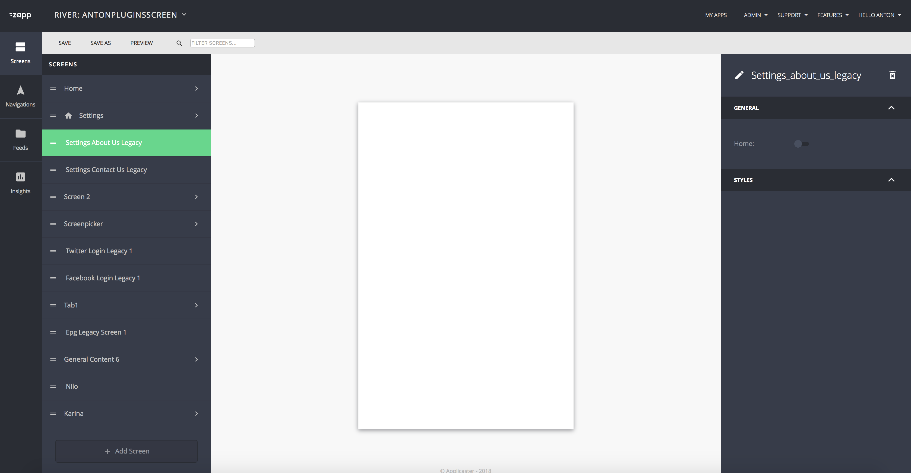
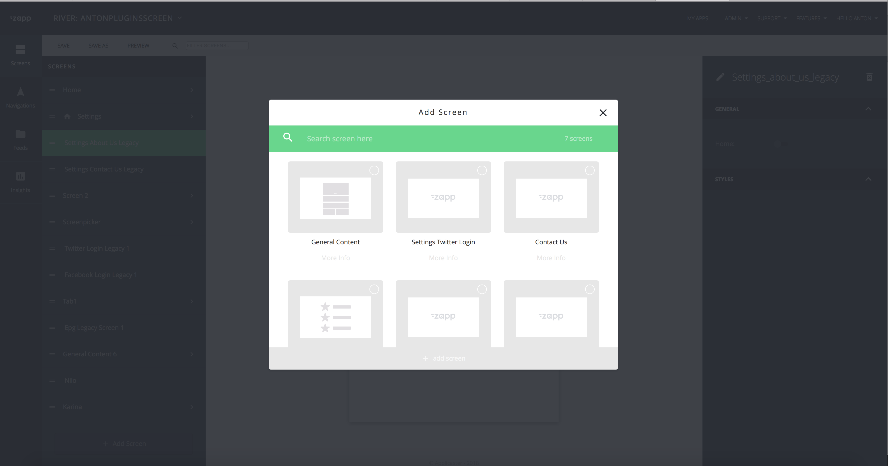
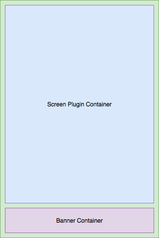

##Zapp Screen Plugins infrastructure
These plugins can be used as a standalone screens.

1. <a href="#description">Description</a>
2. <a href="#general">General</a>
3. <a href="#connection">Connection PlugnsScreen with River.json</a>
4. <a href="#clientExplanation">Client side explanation</a>
4. <a href="#keys">Styles, keys and data source</a>
5. <a href="#screens">React Native screen and Native screens</a>

* * *

<a name="description" />

##### Description
Screen Plugins, that may be presented as screen from navigation bar, root or selected from the any cell inside application. This plugins can be native or react native in this document willl be explained how to confugure such plugin. In addition can be provided by developer to ability to customize your plugin from UI-Builder.


***

<a name="general" />

##### General

Any plugin can be defined as ScreenPlugin. To do it developer need to implement two things.
1. In the manifest of plugin must be added key value: `screen`: `true`. This key is needed to explain UIBuilder that this plugin can be added in the screen section.
2. In the manifest you have to define `presentation` to define expected type of presentation. Will be explained below.
3. On the client side developer must implement protocol `ZPPluggableScreenProtocol` in your plugin adapter. Basically this is simple initialization for your plugin. It needed to provide one generic creation for plugins screen. We are passing there 3 params that can be passed to your screen plugin.
`pluginModel` - Plugin Model itself will be passed in any case.
`screenModel` - ScreenModel that connected to your plugin, it not optional will be passed too
`dataSourceModel` - Data source of your screen plugin. Can be optional. In some cases if your screen wants to use hardcoded data source, rest case if you open your screen plugin pushing one the cell we will pass data source model of the cell

```
    init?(pluginModel:ZPPluginModel,
          screenModel:ZLScreenModel,
          dataSourceModel:NSObject?)
```

<a name="connection" />

##### Connection PlugnsScreen with River.json
After developer will add `screen`:`true` to manifest and upload manifest for you plugin.
You will able to see your plugin in the screen creation list in the UIBuilder

__Example:__ ContactUS or Settings Twitter Login


When user will select `Screen Plugins` behind a scenes `UIBuilder` will add plugin that connected to your screen in `plugins.json` that will be send to app during application creation proccess.

###### River.json screen plugin example
This is example of screen plugin that will be passed with `river.json`
Field `type` is representation of your plugin id `settings_contact_us_legacy`. By this id client will try to find your plugin and try to create your pluggin with `ZPPluggableScreenProtocol` initialization method

```
    {
        "id": "7e8bca21-5f98-4f1b-8541-ce084fffffa6",
        "name": "settings_contact_us_legacy",
        "type": "settings_contact_us_legacy",
        "data": {},
        "styles": {
            "family": "FAMILY_1",
            "presentation": "push"
        },
        "advertising": {},
        "general": {},
        "rules": {},
        "home": false,
        "ui_components": []
	}
```
<a name="clientExplanation" />

##### Client side explanation
###### GAScreenPluginGenericViewController

All screen plugins will be created in GAScreenPluginGenericViewController. This is view controller that has analog of `GAGenericViewController` to create container that will use same rules for same type of the plugins screens.

1. Screen Plugin Container will be used to add your screen plugin inside. This container will be used for native and react native screens.
2. Banner container - placements for the banner. At that moment will be always disabled until it will be implemented on android side.



Since `GAGenericViewController` is working properly with same navigation structure as navigation bar plugin and root plugin. We allow to use same customization that supports generic screens. Navigation bar state will take affect like hidden or present on_top.

Since this your screen will take affect all global customization, if you expect that you want to present your plugin you have to difine proper navigation bar presentation and presentation of a plugins.

###### Presentation type of the plugin.
At that moment with `screen plugins` will allow two states
1. `Push`
2. `Present`
Generally this behaviour will take affect if you will select cell in side your app.
If you going to add a `screen plugin` to `root` or `nav_bar`. Screen Plugin will use default rules of Root or navigation bar.
For `root` it will be `push`
For `navigation bar` it will be `present`.

If you select in presentarion type `present` and you do not wat to have navigation bar. At that moment you have to set in manifest key `force_nav_bar_hidden` : `true`. This field will be needed until we will have enabled set navigation bar state per screen. If you will use this key make sure that you responsible to close screen, since nav bar will be hidden and close button will not be availible.

__Note:__ If use will open screen plugin pushing on cell and presentation type is `present`. `GAScreenPluginGenericViewController` will be presented from navgation bar and will use same rules as item was presented from navigation bar

<a name="keys" />

##### Styles, keys and data source
Since screen plugin is a screen you can pass additional customization and to set up from UIBuilder.

Here manifest example:
__Note:__
1. in current example I do not want to allow user select presentation style of the plugin and added `initial_value` and `type`:`hidden`. This will not show this key to the user.
2. Key `background_color` will allow user to select background color with a color picker.
3. If field `data` can be defined ability to add DS from UIBuilder to your screen plugin
```
{
    "api": {
        "require_startup_execution": false,
        "class_name": "GAEPGContainerViewController",
        "modules": []
    },
    "dependency_repository_url": [],
    "platform": "ios",
    "author_name": "Anton Kononenko",
    "author_email": "a.kononenko@applicaster.com",
    "manifest_version": "0.1.0",
    "name": "EPGLegacyScreen",
    "description": "Legacy EPG Screen",
    "type": "general",
    "identifier": "epg_legacy_screen",
    "screen": true,
    "ui_builder_support": true,
    "whitelisted_account_ids": [
        "57d7bee06466610018000000"
    ],
    "min_zapp_sdk": "7.0.0-Dev",
    "deprecated_since_zapp_sdk": "",
    "unsupported_since_zapp_sdk": "",
    "react_native": false,
    "custom_configuration_fields": [],
    "styles": {
        "fields": [
            {
                "key": "presentation",
                "type": "hidden",
                "initial_value": "push"
            },
            {
                "key": "force_nav_bar_hidden",
                "type": "hidden",
                "initial_value": true
            },
            {
                "key": "background_color",
                "label": "Background Color",
                "type": "color_picker",
                "initial_value": "rgba(43,43,43, 1)",
                "label_tooltip": "Background color of cards."
            },
        ]
    },
    "data": {
        "fields": [
            {
                "key": "source",
                "type": "text_input"
            },
            {
                "key": "type",
                "type": "select"
            }
        ]
    }
}
```
<a name="screens" />

##### React Native screen and Native screens
In this section will be descried difference beetween React Native and native screen plugins.

###### Native

Native Screen plugins as was described before must implement `ZPPluggableScreenProtocol`. If you plugin will have data source it will be passed as NSObject? if you will need to retrieve dictionary from it. You can use ZAAppConnector heper method `ZAAppConnector.sharedInstance().genericDelegate?.datasourceModelDictionary(withModel: dataSourceModel)` - It will retrun raw dictionary of your model.
###### React Native

1. If you are using base class name of you plugin `"class_name": "ZappReactNativeAdapter.ZPReactNativeDefaultProvider"`. Good news that you do not need to implement `ZPPluggableScreenProtocol` it was already implemented.
2. If you are using custom RN plugin and you implement subclass of `ZPReactNativeDefaultProvider` prbably you may want to override `ZPPluggableScreenProtocol` method
3. Implementation for React Native screens

As you can see during init of protocol method we are using standard method if initilization and passing data source and screen models as init porps where we using func `extraScreenPropsWithData(screenModel:dataSourceModel:)`
```
    public required convenience init?(pluginModel:ZPPluginModel,
                          screenModel:ZLScreenModel,
                          dataSourceModel:NSObject?) {
        guard let reactBundleUrlString = pluginModel.reactBundleUrl,
            let reactBundleURL = URL.init(string: reactBundleUrlString) else {
                return nil
        }
        self.init(configurationJSON: pluginModel.configurationJSON,
                  bundleUrl: reactBundleURL,
                  moduleName:  ZPReactNativeManager.Constants.defaultReactModuleName,
                  extraParams: ZPReactNativeBaseProvider.extraScreenPropsWithData(screenModel: screenModel,
                                                                                  dataSourceModel: dataSourceModel))
    }
```

Example of recieving props:
1. We are passing `reactProps[uibuilder_screen_model]` with `ZLScreenModel` dictionary
2. If we have DS we wil pass dictionary of the data source. with key `reactProps[data_source_model]`
3. To support back compatiblity we will pass flat map of `ZLScreenModel` dictionary to give ability to retrieve keys without additional migration. This is temp solution until plguins will be updated properly and use `ZLScreenModel` dictionary to retive data
At the end you will get something like this
```
        {
        "uibuilder_screen_model": {
            "id": "7e8bca21-5f98-4f1b-8541-ce084fffffa6",
            "name": "settings_contact_us_legacy",
            "type": "settings_contact_us_legacy",
            "data": {},
            "styles": {
                "family": "FAMILY_1",
                "presentation": "push"
            },
            "advertising": {},
            "general": {},
            "rules": {},
            "home": false,
            "ui_components": []
        },
        "data_source_model": {
            "source": "general-provider://fetch_data?url=aHR0cDovL2Fzc2V0cy1wcm9kdWN0aW9uLmFwcGxpY2FzdGVyLmNvbS9hY2hpZXZlbWVudC1jZW50ZXIvZ2VuZXJpYy1kYXRhLXNvdXJzZS9uZXdzLnhtbC9OZXdzLUJ1c2luZXNzLnhtbA%3D%3D&type=APPLICASTER_ATOM_FEED",
            "type": "APPLICASTER_ATOM_FEED"
        },
        //Flat map of the `ZLScreenModel` dictionary
        "family": "FAMILY_1",
        "presentation": "push"
        }

```
