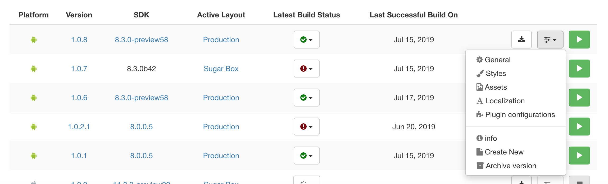
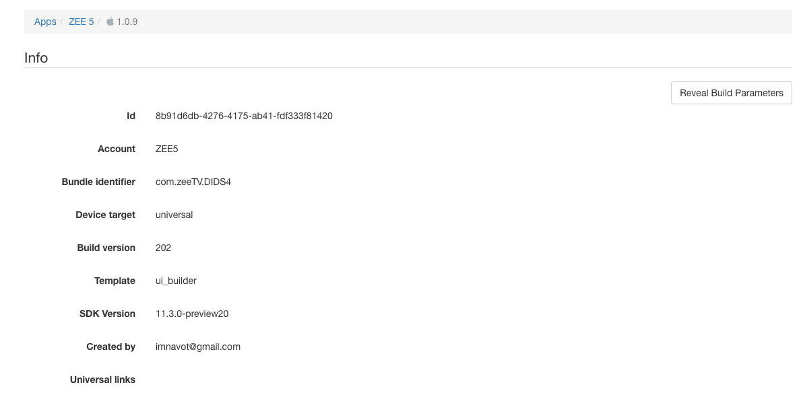

# UI Component

## How to create new component

The new component should be added into ComponentsSDK which is a private Applicaster github repoistory. Contact support if you don't have premissions to the repoistory.

In this capter the classes, prtocols, etc. are located inside the ComponentsSDK repoistory.

1. In `ZLDefines.swift` add the new type of the component under `ZLComponentTypes` enum.

2. In all the func in the `ZLComponentTypes` enum add  the following helper methods for the new component:
    * `func typeByKey(_ key:String) -> ZLComponentTypes `
    * `func componentType() -> String`
    * `func builderClass() -> ZLComponentBuilderStructureProtocol.Type?`

    Note: This is important because other classes will get the new component by key or use the relevant helpers.

3. If you need, you may add `ZLNonPublicComponentsTypes` enum. This enum was created for the case of a component using other components that are not part of API that comes from the `UI-Builder`. In most cases it should not be updated.

4. Create a new class that is subclassed from `ZLComponentBuilderBase` and is inherited from protocol `ZLComponentBuilderStructureProtocol`. `ZLComponentBuilderStructureProtocol` methods should be implemented.

5. If needed you may override methods from `ZLComponentBuilderProtocol` that were implemented in `ZLComponentBuilderBase` class.

6. In the component builder class you should implement the logic of wrapping from ZLComponentModel to [CAComponentModel] to provide a proper conversation, in other words we will create the same structure that we have in the old json style format.
    * [CAComponentModel] should be an array of components models, because one UIBuilder component can represent an array of old style components.
    For example: The `List` component in the UIBuilder can include two components or more, for example `Cell1` and `Cell2`. This will enable different patterns of repeat.
    * Please look at the implementation of the existing builder classes.

7. New component type will be added to the UIBuilder in the manifest. At that moment a Zapp server developer will add it.

*Notes*:
  * Since ZappLayoutsSDK is a wrapper, it can wrap components that already exists in the Components SDK. If you are working on an absolutely new component that does no exist in the ComponentsSDK, you should first implement it in ComponentsSDK before creating the component in ZappLayoutsSDK.
  * Each component may have specific parameters and specific rules that are not relevant for other components, like `carousel style` that is needed only for the carousel component to present page control.
  * After parsing UIBuilder API, all relevant keys and values that were added in the UIBuilder to this component will be in ZLComponentModel and can be used in the ComponentBuilder.

## How to add styles to existing components

1. In the `ZLComponentsMapping.plist` add the new styles or styles that are relevant for your new ZappLayout style. To understand the structure of the plist, review the [[Classes and Plists]] screen.

2. In the `ZLCustomizationLayouts.plist` add the template for the new style. In the template include all old style attributes that the component might use.

3. In the `ZLCustomizationLayouts.plist` key `baseAttributes` add the attributes that are relevant to all styles.
    * Add a dictionary with `component_name_id`, which will be used as an identifier to your component. Inside the dictionary add all the default attributes for your new component.

4. In the `ZLCustomizationLayouts.plist`, under the key `families`, add the new style to an existing family or create a new one in case the family doesn't exist yet.

5. In the dictionary of your family find the `component_name_id` that you are planning to add. In case it does not exist, please add it.

6. Add the key `style_id` to your component dictionary. This id will be used in UIBuilder API. Please choose proper names that will describe the style, following this naming convention: component#_ f#. for example: List3_F1 (F stands for family).

7. Inside the style of the your component, add these two keys: `style` with a String value and `devices` as Dictionary.
    * In the `style` value include a key that will point to `ZLComponentsMapping.plist`. (This plist consists of data for components, which xib to use and what ViewController is used for this component). Review [[Classes and Plists]] screen to see more details about it.
    * Under devices folder add 3 keys as a Dictionary: `universal`, `iphone`, `ipad`
    * In the `universal` dictionary add all the attributes that are relevant to iPhone and iPad.
    * In the `iphone` add all the attributes that are relevant only to iPhone.
    * In the `ipad` add the attributes that are relevant only to iPad.

8. After the new styles were tested, add the new style to the UIBuilder. In the future it would be added in the manifest, at that moment via a Zapp server developer.

Notes:
* One component can use different cell styles and the combination of them.
For example: In a component that has two cell styles, the `First Cell` uses the full width of the screen, and the `Second  Cell` uses half the width of the screen. The Second cell will be repeated till the end of the DS.
* Some components may need not only `cell` styles but also additional styles. Like the Carousel component that has a top layer to present the page controls, allowing different types of controls.
* If your component uses 2 levels like the carousel, add two level styles: `carousel` and `carousel_cell` that may need different level attributes. Some of them will be relevant to the carousel itself, others to the cell style.
* `ZLComponentTypes` enum has `func cellComponentTypeKey() -> String` that will add to your component the  prefix `_cell` if you are using 2 level components. 

## How to Test a new component and style
1. Go to Zapp [website](https://zapp.applicaster.com/app_families) and open the app you're working on.
2. Choose a relavant version and go the the `Info` screen 
3. Click the button `Reveal Build Parameters` 
4. In the build parameters window, find `rivers_url` and download it to your local machine. The river JSON file contains all the details about the different screens in the app.
5. Pick a screen object and add your component.
6. Rewrite the response rivers.json with your local JSON file. You can use Charles proxy or another tool for that. see for example a URL that belongs to one of our apps: https://zapp-client.applicaster.com/zapp/accounts/5c3b12762756be0008779106/apps/com.kan11/apple_store/1.2.0.13/rivers/rivers.json.
7. Open the app again and go your editable screen.