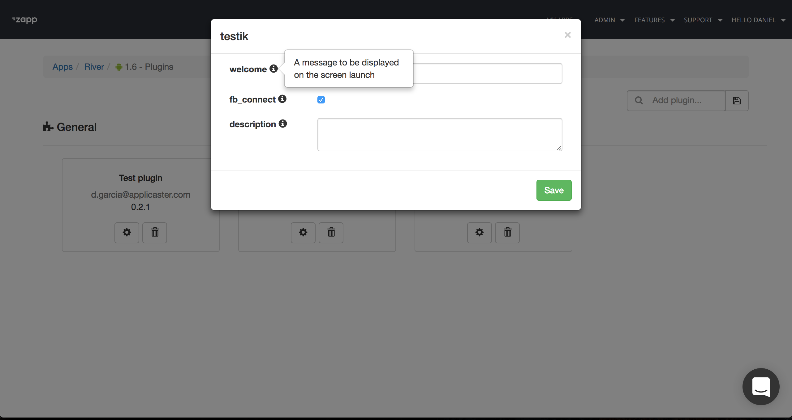
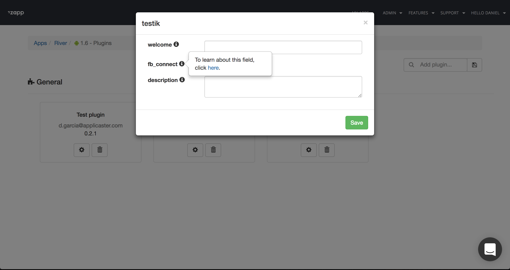
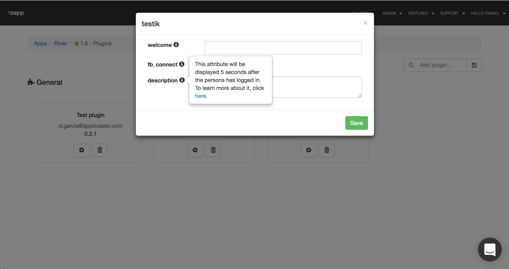

[Zappifest Tool](https://github.com/applicaster/zappifest) is a CLI app that will help you to generate and publish Zapp plugin manifest.

#### Installation

Install via Homebrew
```bash
brew tap applicaster/tap
brew install zappifest
```

#### Upgrade
```bash
brew upgrade zappifest
```

## Usage
### Init
Zappifest allows fast configuration for Zapp plugin-manifest.json file.
Just run `zappifest init` and follow the instructions.

### Publish

#### Prerequisites
Reach Applicaster support team to generate User access-token, assign plugin_developer role and get valid account id's.
Note that plugins with no owner account cannot be updated.

The tool allow you to publish the plugin to Zapp.

Run `zappifest publish --manifest <path-to-manifest-json-file> --access-token <zapp-access-token> --account <valid account id>`

You can optionaly use markdown files for the "About" and "Guide" fields of the manifest. This way, you can control more precisely the layout of what will appear in the "About" and "Guide" tabs of the Plugin Gallery in Zapp. In order to use a markdown file instead of a plain string, remove the `about` or `guide` key in the manifest, and use the following command options :
```
$ zappifest publish --manifest <path-to-manifest-json-file> --access-token <zapp-access-token> --guide <path-to-guide.md> --about <path-to-about.md> --account <valid account id>
```

#### Updating existing plugin
Check the plugin id on [Zapp](https://zapp.applicaster.com/admin/plugins) (under the relevant plugin versions).

Run `zappifest publish --plugin-id <plugin-id> --manifest <path-to-manifest-json-file> --access-token <zapp-access-token> --account <valid account id>`

```
Note: It is recommended to set the access-token as environment variable `ZAPP_TOKEN`.
By doing so, `access_token` param for publishing will not be required.
```

#### Custom Field Tooltips

When you are creating a custom field via the 'zappifest init' instructions, you will be required to create a tooltip describing the custom field so that Zapp users can understand the purpose of the field and how they should handle it.

There are three types of tooltips.

1. Plain Text
    * This will appear like the example below:
        *   
2. Link to an external resource
    * This will appear like the example below:
        *   
3. Text with link to an external resource
    * This will appear like the example below:
        *   
