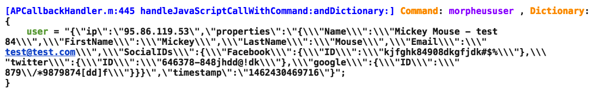

# JS-2-Morpheus

### Service Description

JS-2-Morpheus is a service which enables web-products to send analytics events and user profiles to [Morpheus](http://developer.applicaster.com/docs/internal/morpheus_release_notes), the Applicaster product which handles the delivery of analytics data. This enables web products to gain the same coverage as native analytics events, providing the ability to deliver analytics data to all the providers Morpheus supports as opposed to creating several different integrations directly from each web product. Additionally, the outcome enables analysts to connect the information gathered from the mobile web product with information gathered from the native app and analyze it all in the same place.

### How to integrate

Any developer can use the JS-2-Native API to send analytics data to Morpheus, in the manner outlined in the section titled "Morpheus Integration" of the [JS-2-Native API documentation](http://developer.applicaster.com/docs/public/js2native).

### Testing your integration

Ultimately, you should verify your integration by conducting an end-to-end test, as described at the end of this document. Additionally, there are methods you can use during the integration to check that your data is sending as desired on iOS and Android.

##### iOS

After integrating your web product in a test app, you can check the console logs of an iOS device to see the data is delivering properly. If you have questions on how to launch your web-product from within a test app, you can contact Applicaster Support at support@applicaster.com. 

You can use whatever tool you are most comfortable with to check logs, but if you do not have a preferred tool, we recommend [lemonjar](http://lemonjar.com/iosconsole/). Connect your device to your computer, and using the tool, find the app in the console, trigger events and user profile updates, and check to see if you get the following logs:

***Event Logs:***

The following log illustrates that your webview sent your event command:

After some time, you should see another log which confirms the listener received your event command. This log should look like the following:

If you see a log which states "event came from JS with wrong data", your JSON should be fixed.

***User Profile Logs:***

The following log illustrates that your webview sent your user profile command:

After some time, you should see another log which confirms the listener received your user profile command. This log should look like the following:

If you see a log which states "event came from JS with wrong data", your JSON should be fixed.

##### Android

To test your work on Android:
1. Download the JS-2-Native android test app from [here](https://drive.google.com/file/d/0B7vFqC6jIBcYamdUT1p0N1Y5aU0/view) and install it.
2. Launch the app
3. Set the test url (the url for your web product) in the url section
4. Press "GO" 

5. You should then be able to see your webpage in a webview within the app in the section below the words "input is"
 

6. Trigger the events and/or user profiles that you intend to send
7. Check results. The JSON the device receives will appear in the ‘handle command inputs’ section:

#### End-to-End Testing

1. Integrate your web product in a Zappified Applicaster test app. Contact support at support@applicaster.com if you have questions on how to do this.
2. Configure analytics for the test app via Zapp. You can find directions for how to configure analytics in Zapp [here](https://applicaster.zendesk.com/hc/en-us/articles/206419186).
    * Most analytics providers (Flurry, Google Analytics, Facebook Analytics, etc.) do not enable you to send PII (Personally Identifiable Information) or profile-level user data. Applicaster will still send events to these providers. However, for user profiles, Applicaster supports [Mixpanel](https://mixpanel.com/), an analytics tool which both supports the delivery of PII data and provides engagement and remarketing tools based on this data. If you want to test the delivery of user profiles, make sure to configure a test project for Mixpanel in Zapp. 
3. Trigger the delivery of events or user profiles from your web-product within the test app
4. Verify the data is appearing in the analytics providers that you configured in Zapp as desired

