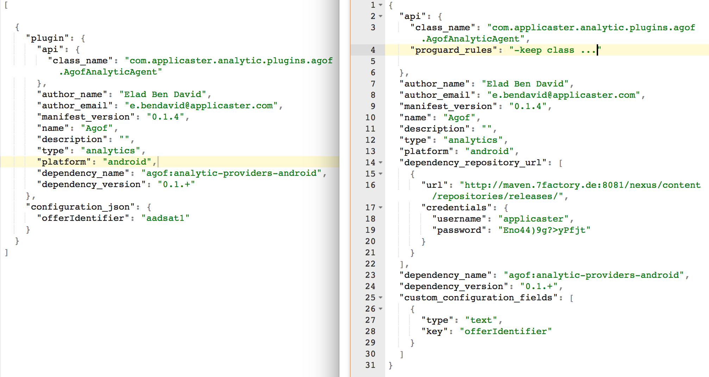

## How to add analytic plugin in Android integration application:
Applicaster supports a variety of analytics providers to which you can send your analytics data. On Android, some Analytics providers are handled via a “plugin” system, and others are not plugins and sit directly on the Applicaster SDK. For the non-plugin providers (Google Analytics and Mixpanel), speak with your Applicaster Account Manager and ask them to configure it on Zapp (Applicaster’s configuration system). Note: On iOS, all providers are set up as plugins.

The directions below outline how to add an analytic plugin to an Applicaster product or features integrated into a non-Applicaster app:
  
1. Get plugin manifest json(Plugin section in Zapp).
2. Concatenate the dependency_name and the dependency_version with ‘:’ between.  
    for example:  
    ```bash
    ‘flurry:analytic-providers-android:0.1.0’.  
    ```
    past the result dependency on the build gradle in the dependencies section.  
For example:  

    ```bash
    dependencies {   
        compile ‘flurry:analytic-providers-android:0.1.0’
    }
    ```
3. Copy proguard_rules property into the ‘proguard-rules.pro’
4. If dependency_repository_url property is not empty, create new maven repository in the build.gradle and copy it into. If not, make sure you have credentials for applicaster account in maven.
5. In ‘res/raw’ folder create new file ‘plugin_configurations.json’ and copy the
    json below:
    ```bash
      [
            {
          "plugin": ‘Here past the content of the plugin manifest’,
          “Configuration_json”:{
            "api_key": "23498efsdhkj324"
          }
        }
      ]
    ```
    *   In the ‘plugin’ property past the content of the plugin manifest.  
    Remove proguard_rules and dependency_repository_url properties.
    * In the ‘Configuration_json’ you need to configure the json variable, you can find the json variable list in custom_configuration_fields property in plugin manifest.  
    
    For example:  
You can see from the left the plugin_configurations.json’ file and from the right the plugin manifest.  
   
