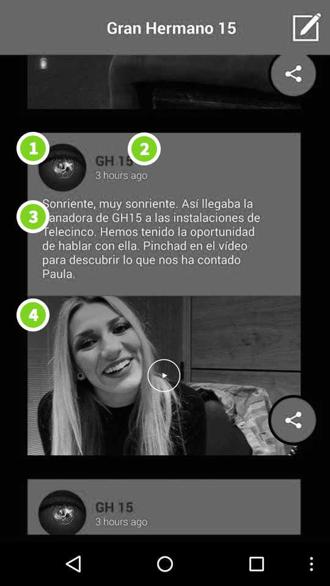

# Stars Public API v3 (Feed & Crossmates)

This document describes the Stars Public API and it is used to read events
form both the Feed & Crossmates Applicaster products. Before implementing this API in your app please make sure you contact the code owner in order to know that it matches your needs.


# Terminology

## Timeline
A timeline is a container of events and can be of type "crossmates" or "feed".
Each account can have more than one timeline.

## Feeds (event sources)
A Feed describes the published sender of a broadcaster event and typically has
the same name of the show (see diagram below #1 #2).

## Events
An Event is a content post that is sent to the end user in a given time.

## Episodes (Feed type only)
An episode describes a range of time in which a timeline is active and viewable
by the end user on the device.

## Zones
A zone is a scope of events and episodes that refers to the closest available
timezone of the client. `Feeds` `Episodes` & `Events` are all scoped to the set
timezone and MUST be declared on each GET request for each of those models.
A Timeline can have more than one zones.

## Timeline Customizations (Feed type only)
The Feed look and feel can be controlled from a remote server. The timeline
customisation is an API end point that holds the list of configurable items - color values and URLs for images and icons.


# Common Workflow for *Feed* Type timeline

## prerequisites
* To access the timelines you must have an Applicaster `<account_id>`.
* `<Base URL>` for production server requests is `http://stars.applicaster.com/`
* `<Base URL>` for any other environment server (e.g. qa)
is `http://stars.<environment-name>.applicaster.com/`

## Workflow

> Note: The API exposes more fields for other usege - only the relevant JSON
properties that are used by the Feed are documented.




* 1 - Events source (feeds) avatar
* 2 - Events source (feeds) name
* 3 - The event text
* 4 - The event image

### Request for available timelines

**Request:** GET `<Base URL>/v3/accounts/<account_id>/timelines.json`

**Response:**

```javascript
[
  {
    id: "<timeline_id>", //the timeline ID
    live: true, //If set to false the client should treat the timeline as hidden for the end user view
    name: "Adventure Time with Finn and Jake",
    zones: {
        "514ebfe878249b1c11999002": -21600, // GMT offset in seconds, for example GMT-6
        "514ebfe878249b1c11999004": 3600// GMT +1
    },
    type: "feed", // Can be crossmates or feed
    poll_policy: {
		events_rate: 30, // the refresh rate in seconds to request for new events
		facebook_posts_rate: 30, // the refresh rate in seconds to request for new Facebook posts
		twitter_tweets_rate: 30, // the refresh rate in seconds to request for new Twitter tweets
		facebook_posts_count: 50, // Limit for Facebook posts on each request
		twitter_tweets_count: 50 // Limit for Twitter tweets on each request
	},
  },
  ...
]
```

### Request for next 5 episodes (including current one)
Choose the zone that is the closest the yours - typically there will be only one
 zone so pick that one.

> Note: If there isn't any live episode at the moment the client should treat
the timeline as disabled and can present a countdown to the up next set episode
if available.

**Request:** GET `<Base URL>/v3/zones/<zone_id>/episodes.json`

**Response:**

```javascript
[
	{
		name: "Episode name",
		welcome_text: "welcome", //The text to appear as the first event in the Feed
		end_text: "end", //The text to appear as the last event in the Feed
		facebook_page: "1437221886512103", // The connected Facebook page
		external_link: { //external link e.g. URL scheme for the live view in the app
			label: "google",
			url: "http://www.google.com"
		},
		enable_fb_post: true, // Should we allow user posting from the Feed? Set to false if the Facebook page is restricted for comments
		id: "54a3bd86c0a406979f000001", // episode ID
		starts: 1420019640, //Unix timestamp describing when the episode starts
		ends: 1420193323, //Unix timestamp describing when the episode ends
		twitter_hashtags: [ //array of twitter hashtags or usernames to pull from
			"#baby" // can be also @someusername to pull data from a specific username
		],
    hashtags: [ //array of hashtags to pre-fill user posts on the feed (from Feed v3)
      "#hello"
    ],
		image: { //The image of the episode typically used for the start and end events image
			default_image: "http://assets-production.applicaster.com/qa/stars/uploads/54a3bd86c0a406979f000001_1420017035.jpg",
			thumb: "http://assets-production.applicaster.com/qa/stars/uploads/thumb_max800_54a3bd86c0a406979f000001_1420017035.jpg"
		}
	}
]
```
###  Request list of timeline feeds (event sources)
A timeline can have more than one event sources (called feeds in the v3 API)
that can broadcast an event.
This allows to add metadata on top of each event like the name
(1 in the diagram above) and avatar (2 in the diagram above) of the event source.

**Request:** GET `<Base URL>/v3/zones/<zone_id>/feeds.json`

**Response:**

```javascript
[
  {
    id: "514ebfe878249b1c11000002",
    name: "Feed name",
    image: {
      default_image: "http://assets-development.applicaster.com/uploads/x_2280ec90.jpg",
      thumb: "http://assets-development.applicaster.com/uploads/thumb_x_2280ec90.jpg"
    }
  },
  ...
]
```

### Request a list of events
Returns last 25 events from last to first (after `unix_timestamp_utc` and until
  `Time.now`).
On most cases you should put on the since param the timestamp of the last event
you got on the previous request.
For the first request put the `start_time` of the episode.

The following event types are supported in the Feed (and described and the
response example below);

* Link event
* Message event
* Image event
* Video event
* Audio event
* Questionnaire event - soon to be replaced by a new question mechanism.
* Widgets Question - soon to be replaced by a new question mechanism.

**Request:** `<Base URL>/v3/zones/<zone_id>/events.json?feed_ids[]=<feed_id1>&feed_ids[]=<feed_id2>&feed_ids[]=<feed_id_n>&since=:unix_timestamp_utc`

**Response:**

```javascript
[
 //Link event
 {
   id: "514f00c378249be220000003",
   text: "link text"
   type: "link",
   timestamp: 1364990487, // UNIX UTC timestamp
   link: {
     url: "http://www.google.com",
     orientation: 2, // 0-portrait, 1-landscape, 2-both
     close_button: false,
     navigation: false,
     fullscreen: true
     is_take_over: true //boolean should the link pop out as a takeover (from Feed v3)
     take_over_duration: 0 //in seconds default to 0 - can be null if is_take_over isn't set. close the link takeover automatically after the set seconds
   },
   feed_ids: ["515ab77578249b379e000004"], //Using this id you can add get the extra metadata from the matching event source (the feeds array) e.g. event source name and avatar.
   image: {
     default_image: "http://assets-development.applicaster.com/uploads/x_2280ec90.jpg",
     thumb: "http://assets-development.applicaster.com/uploads/thumb_x_2280ec90.jpg"
   },
   image_orientation: "portrait", // or landscape
 },
 // Message event
 {
   id: "514f00c378249be220000003",
   text: "I bet you want to know more about my life?",
   timestamp: 1364990487, // UNIX UTC timestamp
   feed_ids: ["515ab77578249b379e000004"],
   type: "message",
 },
 // Image event
 {
   id: "514f00c378249be220000003",
   text: "I bet you want to know more about my life?",
   timestamp: 1364990487, // UNIX UTC timestamp
   feed_ids: ["515ab77578249b379e000004"],
   image: {
     default_image: "http://assets-development.applicaster.com/uploads/x_2280ec90.jpg",
     thumb: "http://assets-development.applicaster.com/uploads/thumb_x_2280ec90.jpg"
   },
   image_orientation: "portrait", // or landscape
   type: "image",
 },
 // Video event
 {
   id: "514f00c378249be220000003",
   text: "I bet you want to know more about my life?",
   timestamp: 1364990487, // UNIX UTC timestamp
   feed_ids: ["515ab77578249b379e000004"],
   image: {
     default_image: "http://assets-development.applicaster.com/uploads/x_2280ec90.jpg",
     thumb: "http://assets-development.applicaster.com/uploads/thumb_x_2280ec90.jpg"
   },
   video: "http://assets-development.applicaster.com/uploads/thumb_x_2280ec90.mp4",
   type: "video",
 },
 // Audio event
 {
   id: "514f00c378249be220000003",
   text: "I bet you want to know more about my life?",
   timestamp: 1364990487, // UNIX UTC timestamp
   feed_ids: ["515ab77578249b379e000004"],
   image: {
     default_image: "http://assets-development.applicaster.com/uploads/x_2280ec90.jpg",
     thumb: "http://assets-development.applicaster.com/uploads/thumb_x_2280ec90.jpg"
   },
   image_orientation: "portrait", // or landscape
   audio: "http://assets-development.applicaster.com/uploads/come-on.mp3",
   type: "audio",
 },
 //Questionnaire event
 {
   id: "514f00c378249be220000003",
   text: "questionnaire text"
   type: "questionnaire",
   timestamp: 1364990487, // UNIX UTC timestamp
   link: {
     url: "http://admin.applicaster.com/activities/referrer/51bf18c29415b0d69e0003e1/51bf19626f9bc5fe8a0008a7,51bf19dc9415b0d69e0003e3",
     orientation: 2, // 0-portrait, 1-landscape, 2-both
     close_button: false,
     navigation: false,
     fullscreen: false
   },
   feed_ids: ["515ab77578249b379e000004"],
   image: {
     default_image: "http://assets-development.applicaster.com/uploads/x_2280ec90.jpg",
     thumb: "http://assets-development.applicaster.com/uploads/thumb_x_2280ec90.jpg"
   },
 },
 //Widgets Question
 {
	text: "Question text",
	type: "widgets_question",
	image_orientation: "landscape",
	feed_ids: ["54a26449c0a4063338000001"],
	id: "54a4e124c0a406f0d0000003",
	timestamp: 1420091692,
	image: {
		default_image: "http://assets-production.applicaster.com/qa/stars/uploads/54a4e124c0a406f0d0000003_1420091684.jpg",
		thumb: "http://assets-production.applicaster.com/qa/stars/uploads/thumb_max800_54a4e124c0a406f0d0000003_1420091684.jpg"
	},
	widgets_question: { //The URL for the widgets_question API will be provided on a different doc - ask data from Applicaster product.
		url: "http://widgets.qa.applicaster.com/api/public/v1/questions/54a4e124c0a40666f70005e7.json",
		ends_at: 1420091932,
		is_take_over: false
	},
	template: "quiz_image"
},
 ...
]
```

### Request bounded (by amount, and moment in time) events

This new entrypoint adds a new _mandatory_ `amount` parameter. This parameter allows the server to
know the amount and direction in time for event to fecth. So a value of `3` (positive 3) means to
fecth 3 events triggered immediatly after the sent `since` parameter. A value of `-8` (negative 8)
means to fetch 9 events triggered immediatly before the `since` parameter.

**Request:**
```
<Base URL>/v3/zones/<zone_id>/bounded_events.json?event_source_ids[]=<event_source_id1>&event_source_ids[]=<event_source_id2>&event_source_ids[]=<event_source_id_n>&since=:unix_timestamp_utc&amount=-13
```

**Response:**

The response looks exactly the same (in terms od attributes) as the one in the previous entry point example.

> Note: If any of the attributes `event_source_ids`, `amount`, `since` is missing in the request then the
response will have a `403` (forbidden) status.

### Request timeline customizations (Feed Only)

Returns a list of configurable properties for the Feed look and feel.

> Note: Colors are represented in aRGB format. More information can be found here: [http://en.wikipedia.org/wiki/RGBA_color_space#ARGB](http://en.wikipedia.org/wiki/RGBA_color_space#ARGB)

**Request:** GET `<Base URL>/v3/timelines/<timeline_id>/timeline_customizations.json`

**Response:**

```javascript
{
  colors: {
    main_color: "ffc60021", //color in aRBA format see note above
    secondary_color: "ff242424",
    text_color: "ffdadada",
    background_color: "fffefefe"
  },
  icons: {
    like: "http://...png", //Image URL can be null if no image is set
    liked: "http://...png",,
    retweet: "http://...png",,
    retweeted: "http://...png",,
    share: "http://...png",,
    write_a_post: "http://...png",,
    comment: "http://...png",,
    live: "http://...png",,
    back: "http://...png",
  },
  images: {
    background_portrait: "http://...png",,
    background_landscape: "http://...png",
  }
}
```

# Common Workflow for *Crossmates* Type timeline

>Currently the Crossmates public API is not available for 3rd party
implementation. Please contact Applicaster product for support on that matter.
