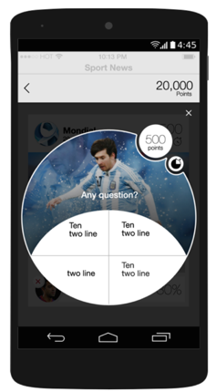

# Feed Release Notes

***

## 3.3 WONDERWOMAN - (Jul 8, 2015)

### New Features

#### Event teaser images can be on any ratio
The Feed will present any image you upload on the ratio of the original image as it was uploaded.
On previous Feed versions images were cropped unexpectedly.

#### Transparent Takeover
It is now possible to add a *takeover behaviour* to a link event and to set a transparent background to it.

### Bug Fixes

#### iOS

| Bug # | Description |
| --- | --- |
| SF-1744 | Achievement Center Leaderboard gives out wrong Facebook profile links
| PLAT-255 | Using the Achievement Center from different devices
| SF-1765 | URL scheme does not lead to Feed, only to app
| SF-1763 | Old Twitter icon in the Feed sign in page
| SF-1755 | Scan preview leads to the app instead the Feed
| SF-1788 | Achievement Centre - No Facebook friends in the friends list of
| SF-1747 | Facebook posts appear twice on iOS
| SF-1737 | Feed pulls too many Twitter items
| SF-1774 | The Social Button test is overlapping with Post text.
| SF-1719 | When clicking on a share activity the entire screen jumps to the left for a
| SF-1665 | iOS Feed Video Landscape
| SF-1657 | Wrong character when sharing texts
| SF-1656 | First time Feed opens, social button stuck
| SF-1810 | Spinning wheel and Welcome screen disappears
| SF-1807 | Inline banner behaviour corrupted
| SF-1801 | Bottom banner disappears
| SF-1802 | Video question event in a takeover- Video corrupted
| SF-1808 | Wheel appears in portrait and it should be landscape

#### Android

| Bug # | Description
| --- | ---
| SF-1774 | Achievement Center Leaderboard gives out wrong Facebook profile links
| PLAT-255 | Using the Achievement Center from different devices
| SF-1761 | Share with FB/Twitter/mail leads to the app instead the Feed
| SF-1765 | URL scheme does not lead to Feed, only to app
| SF-1777 | Old Twitter icon in the Feed sign in page
| SF-1775 | Email/Twitter sharing image event shares wrong image or none at all
| SF-1664 | Problem adding DFP bottom/in-line banners in Feed 
| SF-1653 | Each time you click the Facebook/Twitter button it adds an extra space.
| SF-1656 | First time Feed opens, social button stuck
| SF-1685 | Feed black screen with spinner when coming back from other activities
| SF-1806 | Native video question Android
| SF-1805 | String error
| SF-1809 | The wheel of points appears over the title on tablet landscape Android

### Known Issues

#### Android

| Bug # | Description |
| --- | --- |
| SF-1898 | Time’s up! text is too big in some devices
| SF-1530 | When retweeting a post and going back into the Feed a second time, the retweet icon is unchecked
| SF-1890 | When scanning customization preview - Color change in Feed in addition to the Preview screen

#### iOS

| Bug # | Description |
| --- | --- |
| Factory-799 | URL scheme to feed doesn't open the timeline

