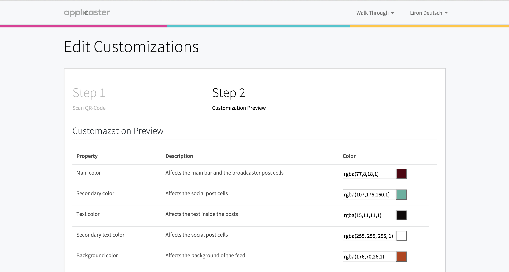

## Group Chat Setup

### Overview

This internal document is intended for Applicaster employees to understand what is the Web Group Chat product, how to configure the link for it per customer, and how to customize it.

### Product Description

The product enables end users to become viewers of personal chats between stars of the show, hosts, or any other relevant VIP’s. 

This product keeps users up to date and involved in the show off broadcast time, in a fun and engaging way. 
The broadcaster can easily define the characters, write the chat content and customize the look & feel of the group chat front-end within the starlight CMS. 
The end users get to follow the conversation, like and share bits of the talk. 

### Link Configuration

It is possible to have more than one group chat in an account, and if so, we can display a selection menu.
In this case please note that the menu will show ALL timelines in the account as though they were group chat, so if you are planning to use this link make sure the **account only has group chat timelines**.

#### Selection Menu Link

The link to selection menu of the group chat will always **start** like this: 

    http://assets-production.applicaster.com/static/groupchat/1.1/index.html

This link has several parameters that need to be added:

**account** - The Starlight account ID. 
This can be obtained from the link in Starlight, as it appears after the 'accounts', see picture below.

 
**timeline** - The Starlight timeline ID.  
This can be obtained from the link when opening the relevant feed (=timeline) in Starlight, as it appears after the 'feeds', see picture below.

**topbar** (Optional) - If the value is set to 0, no top bar will appear (this is good for when displaying the group chat web inside the Group Chat Messenger app, for example, otherwise this is irrelevant).

#### Single Group Chat Link

The link to a single group chat will always **start** like this: 

    http://assets-production.applicaster.com/static/groupchat/1.1/chats/index.html

This link has several parameters that need to be added:

**account** - The Starlight account ID (obtained as explained above).

**timeline** - The Starlight timeline ID (obtained as explained above).

**topbar** (Optional) - If the value is set to 0, no top bar will appear (this is good for when displaying the group chat web inside the Group Chat Messenger app, for example, otherwise this is irrelevant).

**name** - Title of the groupchat which will appear at the top of the page.

  
**image** - URL of an image of the groupchat which will appear in the right top corner of the page.  

**environment** - If the account is not in production, an environment must be specified (qa / demo / server). 

**active** - Always add the parameter "active=1" to the inner chat.

Here’s an example of what the link may look like once the parameters are configured:

    http://assets-production.applicaster.com/static/groupchat/1.1/chats/index.html?account=54aa34dfa4f7c396da00001e&timeline=55d574b116fa3ac02e00000c&environment=qa&name=Our%20Family&image=http://assets-production.applicaster.com/qa/stars/uploads/thumb_max800_55d9862c16fa3a2247000001_1440319020.png&active=1

### Customization
Group Chat customization can be controlled using the [Starlight CMS](http://cms.applicaster.com) customization section which can be found on the main feed page:

#### Color Customizations
When going into the customization section, step 2 is the one that is relevant for Group Chat, and it allows the color customizations at first:

Below is a description of each color type and what it affects:

**Main color** - The title bar background color.   
**Text color** - Fonts color.   
**Secondary color** - Bubbles color.  
**Background color** - The page's background color.

#### Icon Customizations
Secondly, the section below allows icon customization.
For this product, only the Liked and Like icons are relevant, and these are the buttons that will be displayed next each message.

### Enabling Group Chat In The App

In order for the customer to have group chat available in the app, they will need to create a link category/banner that links to the link configured by us (explained above). 

Now what is left for the customer is to start shooting events from the relevant event sources (the members of the group chat). 

Please note that the group chat will be live as long as there is a live episode in the feed the group chat is attached to.
