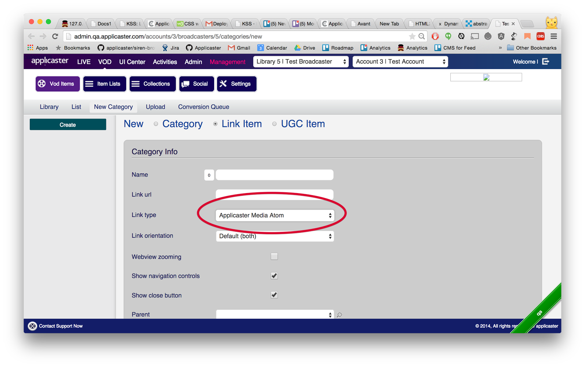

| Version | Description |
| - | - |
| 1.0.0 | First Release. |
| 1.1.0 | Support for image galleries. |
| 1.2.0 | Notations about "updated", "summery", "author name" and "alternate link" elements. |
| 1.2.1 | Support of inline images in article. |
| 1.3.0 | Support of video resource type |

# Overview
Applicaster *Media Atom Feed* is a feature that
allows the broadcaster to integrate list of
External resources and present them in the app.
Currently Applicaster supports the following 
resource types: **Article**, **Gallery** 
and **Video**. The broadcaster should host the
resources in its own servers and provide
Applicaster with the links to the Atom feeds
according to the specifications
below.

* Video - HLS video content, uppon tapping the content will be preseted on a standard video player.

### Setup

Each Atom Feed link will need to be added to
Applicater CMS into the appropriate Applicaster
Category link and declared as an "Applicaster Media Atom" link type.

>The app will maintain the same order and structure
as those in the provided Atom Feed.

# Media Atom Feed Specifications
The key words "MUST", "MUST NOT", "REQUIRED",
"SHALL", "SHALL NOT", "SHOULD", "SHOULD NOT",
"RECOMMENDED", "MAY", and "OPTIONAL" in this
document are to be interpreted as described in
[RFC 2119](http://tools.ietf.org/html/rfc2119).

The *Applicaster Media Atom Feed* format conforms
with the Atom 1.0 Standard as described at [RFC
4287](http://tools.ietf.org/html/rfc4287) and MUST
pass the [W3C Atom
Validator](http://validator.w3.org/feed/).

Each Atom feed SHOULD hold multiple “atom:entry”
nodes.
Any change done in an existing Atom Feed will be
available immediately on the client after app
start up and without the need to change anything
on the Applicaster CMS.

> **Note:** Make sure your servers can hold the
amount of expected concurrent users. As a rule of
thumb the Atom Feed should be cached and served
from a CDN.

>  **Note:** Any caching mechanism set on the
broadcaster's servers will be reflected on the
client. HTTP\`s `Cache-Control` header with a
`max-age` directive. [Section 14.9 of RFC
2616](http://www.w3.org/Protocols/rfc2616/rfc2616-
  sec14.html#sec14.9)
  Conditional GET using `If-Modified-Since`,
  `If-None-Match` (sections 14.25 & 14.26)

  

  ##### Feed Examples

  * Feed that holds mix of video and article entries.
	[Link](https://gist.githubusercontent.com/PhilipKram/46117bb42124caac6640/raw/fac1c565c25c486f35a0eee56608f5cd54c5d17e/atom-article+video.xml)
    
  * Feed that holds image gallery entries.
	[Link](https://gist.githubusercontent.com/PhilipKram/e572ba6cfe96a2b2cc59/raw/d05afd656ae332eccc633f19a09bcbdad7e868bd/atom-gallery.xml)

## Elements and Attributes Description
Described below are all the custom extensions
added to the Atom 1.0 Standard.

### feed
`<feed>` XPath: /feed

The `<feed>` element MUST contain the
`xmlns:applicaster="http://schemas.applicaster.com
/atom/1"` namespace.

***

### entry
`<entry>` XPath:
/feed/entry

The `<entry>` element block represents a single
item in the Feed list. There SHOULD NOT be more
than 30 entries on a single feed.

### applicaster type
`<applicaster:type>` XPath:
/feed/entry/applicaster:type

The **entry** <applicaster:type> element
MUST be added and its `value` attribute MUST be set
to one of the following:
* For Article use: `<applicaster:type
value="article"/>`

* For Video use: `<applicaster:type
value="video"/>`

* For Image-Gallery: `<applicaster:type
value="imageGallery"/>`

* For Image use: `<applicaster:type
value="image"/>`

### updated
`<updated>` XPath:
/feed/entry/updated

If added the field will be visible for the end user.

### title
`<title>` XPath:
/feed/entry/title

The `<title>` element represents the
title of the entry. The title element SHOULD NOT
exceed the total of 33 characters. Titles that
have more than 33 characters will get truncated on
the item teaser.

### summary
`
` XPath:
/feed/entry/summary

If added the field will be visible for the end user.

### name
`<name>` XPath:
/feed/entry/author/name

If added the field will be visible for the end user.

### link [rel="alternate", type="text/html"]
`<link>` XPath:
/feed/entry/link

If `<link>` element exists and its set rel attribute is "alternate"
and its set type attribute is "text/html". The
href value of the link will be used as the shared link URL of the entry.

### content
`<content>` XPath:
/feed/entry/content

The `<content>` element `type` attribute
depends on the Entry type:
* For Article use <kbd>html</kbd>
* For Image use one of the following types:  
<kbd>image/png</kbd>, <kbd>image/gif</kbd>,
<kbd>image/jpg</kbd>, <kbd>image/jpeg</kbd>
* For Video use <kbd>video/hls</kbd>
* For Image-gallery use
<kbd>application/atom+xml</kbd>

Article type MUST contain the escaped embedded HTML markup
within.
Any HTML tags that are not of the following `
`,
`<a>`, `<strong>`, `<h2>`, `<h3>`, `<h4>`, `<h5>`, ``
Aren't recommended and can cause bad article formatting.

* Image type MUST have a `src` attribute with the
link to the full sized image. The maximum image
size SHOULD NOT be bigger than 1200x1200px.
The image is responsive to the device screen on Android only.
One Image is allowed per row.
Multiple inline images are possible per article.

* Image-gallery type MUST have a `src` attribute
with the link to an *Applicaster Atom Feed* that
holds image entries with an element set to
`<applicaster:type
value="image"/>`. Entries without
the `<applicaster:type
value="image"/>` element will be discarded.

### applicaster media group
`<applicaster:mediaGroup>` XPath:
/feed/entry/applicaster:mediaGroup

The `<applicaster:mediaGroup>` element groups
media assets from the same type. Following are the
supported group types:
* <kbd>thumbnail</kbd>: Is an image that will be
used to show the item in a collection view. It
will normally be relatively small in size. It
SHOULD have 16:9 aspect ratio.
* <kbd>detailed-view</kbd>: Relevant only for
articles - hold the articles item image in full
view mode.
* <kbd>video</kbd>: Relevant only for
articles - hold the articles item video. 
Please note: 
	* The play button will present from the app and should not be include in the video image. 
	* In case the entry include "detailed-view" and "video" types the app will ignore the "detailed-view" and will show only the "video". 

### applicaster media item
`<applicaster:mediaItem>` XPath:
/feed/entry/applicaster:mediaItem

The `<applicaster:mediaItem>` element MUST be
contained inside a `<applicaster:mediaGroup>`
element.

The `scale` attribute MUST be set to
<kbd>small</kbd> or <kbd>large</kbd>. Large device
screens will use the image with the
<kbd>large</kbd> attribute, while devices with
small screens will use the image with the
<kbd>small</kbd> attribute.
* When set to <kbd>large</kbd> scale - maximum
image size SHOULD NOT be bigger than 800x800px.
* When set to <kbd>small</kbd> scale - maximum
image size SHOULD NOT be bigger than 400x400px.

>  **Note:** In the case that the large
image isn't provided all devices will use the
provided small image. Only devices that
have a large screen will show large
images.
