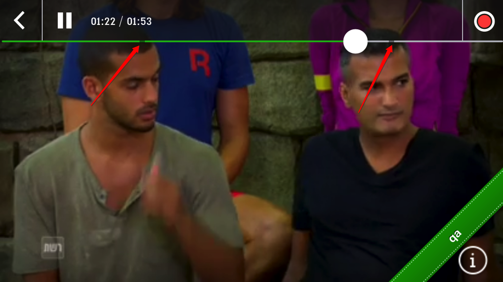

# Midrolls Release Notes

### Product Description

Midrolls enables our customers to monetize by serving video ads in the middle of video content, more similar to the TV experience, rather than at the beginning of video content. 

Midrolls are preferrable to pre-rolls as midrolls have less of an impact on video viewing; viewers are less likely to bounce out of a video during an advertisement if the ad comes in the middle of content rather than prior to it. Midrolls are also preferrable to post-rolls as they have higher impression and completion rates.

For information on how to configure midrolls as a customer, see this video-tutorial [here](https://applicaster.zendesk.com/hc/en-us/articles/208005076-Configuring-Midrolls).

As a support agent or PM, for information how to enable the fields for midrolls configuration, see this documentation [here](https://applicaster.zendesk.com/hc/en-us/articles/207983116-How-to-setup-midroll-fields-in-extensions).

### Release 1.1.0

Midrolls 1.1 addresses the limitations described for Release 1.0.0 below. It is supported on Zapp SDKs 2.6.2 and above (on Android) and 4.1.0 and above (on iOS).

It works together with video analytics providers. 

Additionally, if an ad unit is not valid, it will not appear in the UI of the seeker and the main content will not be interrupted or paused to search for the ad. Rather, we've added logic such that upon loading the video we check to validate if the ad units are valid, and if they are not, they are removed from the UI. Additionally, in case the ad unit becomes invalid during video play, we run a second check prior to loading the video ad with enough time buffer that if the ad has become invalid, it will not disrupt the UX of the video viewing experience and will simply continue the main stream through the ad break. 

This also means that "waterfall" configuration is not required, as outlined above. This enables you to ensure that you only use midrolls when you are below your quota and within your targeting params of higher priced ad sales and do not interrupt the video experience with lower quality and lower price ads typically associated with the back-fill of "waterfall" advertisements.

### Release 1.0.0

Support for video ads served from Google DFP on Zapp Mobile Apps.

One ad unit per device type (iPhone, iPad, Android Smartphone, Android Tablet). 

Ad insertion is based on an interval in seconds, configured in the CMS, as outlined in the [video tutorial](https://applicaster.zendesk.com/hc/en-us/articles/208005076-Configuring-Midrolls). 

Midroll ad breaks are visualized in the seeker of the video player UI, as demonstrated below:

#### Limitations

Midrolls 1.0 does not support video analytics providers like Akamai Media Analytics or comScore Stream Sense.

Additionally, Midrolls 1.0 requires that a valid ad unit must be configured in the CMS. If the ad unit has a date expiry, be sure to remove the ad unit from the Applicaster CMS before that date hits. If an expired ad unit or one that is otherwise limited (i.e. geotargetted) is configured, and this causes the ad unit to be invalid for a user, then the video content will pause and temporarily load the advertising video player during the middle of video play.

To avoid this, you can set up a "waterfall" configuration in DFP so that you have fallback ad units in case the original ad unit is not valid.

If you do not want to use a waterfall configuration on DFP or you use a video analytics provider plugin, we recommend you wait for the release of Midrolls 1.1, which is currently in development.

