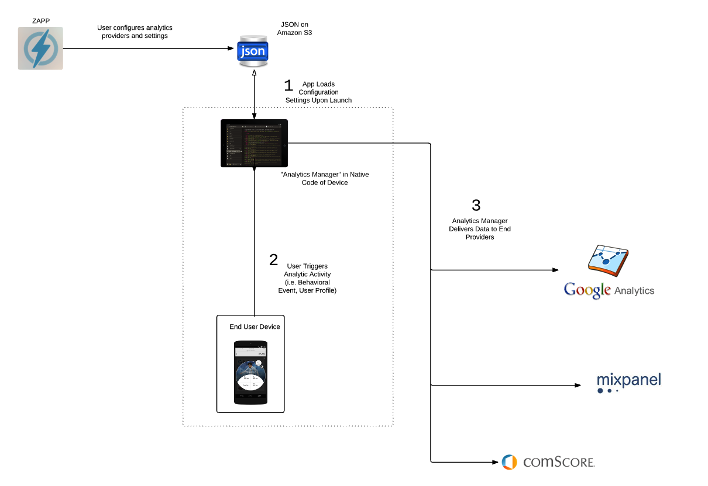

# Morpheus

### Overview

Other developer documentation refers to an Applicaster product called "Morpheus". This document outlines what Morpheus is.

### Product Description
 
Morpheus enables Applicaster to remotely configure which analytics providers to send data to. Users can configure the analytics providers in Zapp. For default analytics providers (those automatically included) and providers included prior to compiling the version build, the configuration fields can be changed remotely in production without requiring a new release.

The aim of Morpheus is to provide greater flexibility and scalability around analytics as opposed to a traditional approach of hardcoded direct integrations.

The infrastructure works as illustrated in the diagram below:

Morpheus supports a "Plugin" system, where third party analytics providers can be "plugged in" to the system and automatically start receiving all of the events referenced above. Every analytics provider has their own set of "out-of-the-box" functionality and events (i.e. retention reporting, session tracking) as part of their SDK, which Applicaster also supports. 

There are two types of Plugins: 1) Default Plugins, and 2) Optional Plugins. 

Default Plugins are switched on automatically in the core Applicaster architecture. This means you don't need to do anything prior to compiling to include them in your build, and after launch, you can still turn them on and change any configuration fields (i.e. API Key). Optional Plugins require that you add and configure them to the app before compiling.

Applicaster currently supports the following behavioral analytics providers:

* Google Analytics
* Mixpanel
* Flurry
* comScore DAX

Applicaster also supports the following video analytics providers:

* comScore Stream Sense
* Akamai Media Analytics

The plugin architecture is complete, but the transition of providers to plugins is still under development. This means that while all of these providers can be supported currently, whether or not they need to be pre-configured as an optional plugin is subject to change as per the development status outlined below:

#### Default Plugins
 
* Google Analytics
* Mixpanel

#### Future Optional Plugins

The following providers are currently set up as Default Plugins and will be moved to Optional Plugins

* comScore DAX
* comScore Stream Sense
* Akamai Media Analytics
* Flurry
	* Already moved to a Optional Plugin on Android 	

Again, please note that providers under open development are still currently supported. Simply, the status of the type of plugin they are is subject to change.

If you are a project manager and want to learn how to configure default plugins in Zapp, click [here](https://applicaster.zendesk.com/hc/en-us/articles/206419186-Configuring-Analytics-at-Applicaster). Standard plugins are configured in the same way that all plugins are configured in Zapp.
