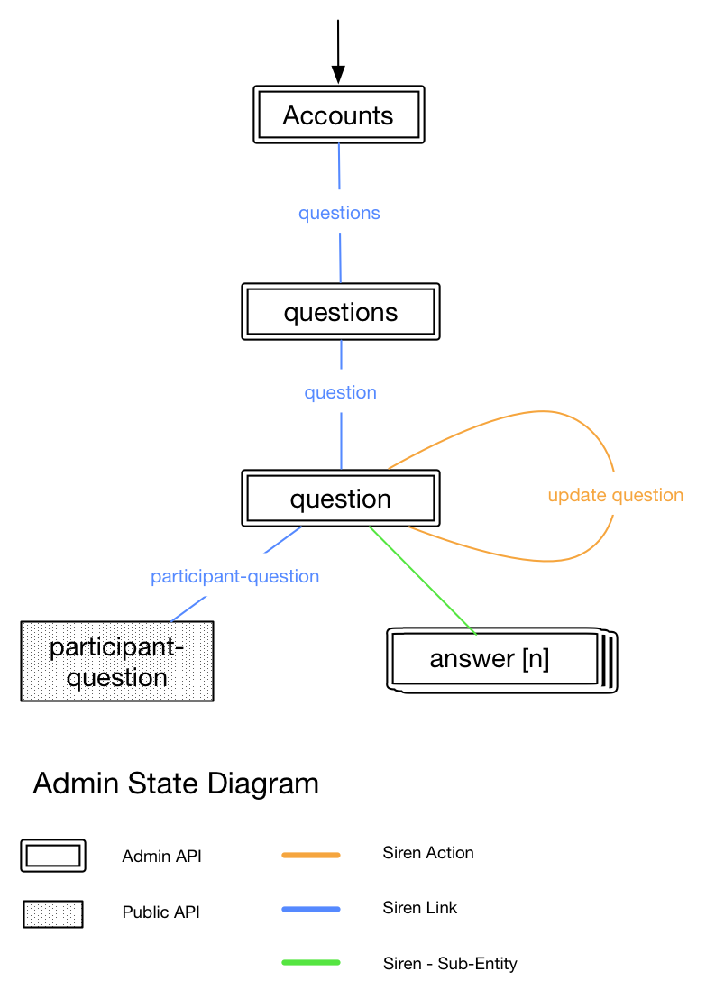

# Private API - Classes Reference
> 

<aside class="notice">
The documentation only provides descriptions for Applicaster domain specific relations. For information about common link relations, see http://www.iana.org/assignments/link-relations/link-relations.xhtml.
</aside>

## accounts

Lists all available accounts that can be accessed with the given authentication
token.
On most cases only one account will be available.

### links
| Relation | Description |
| :-- | :-- |
| self | see accounts class description |


### Properties

This class has no properties.

### Sub Entities

| Class | Description |
| -- | -- |
| [account](#account) | An authorised account with a link to its question.


## account

Provides a basic metadata about the account and a link to its questions. The account class only appears in the accounts class as a sub entity.
### Links

| Relation | Description |
| :-- | :-- |
| questions | Paginated list of all the account's questions. |

### Properties

| key | Description  |
| :-- | :-- |
| id | The unique applicaster account id.|
| name | The set account name as configured on Applicaster Accounts CMS. |

### Sub Entities

This class has no sub entities.

## questions

A List of the account's created questions.

### Actions

* Redirect to **new question wizard** by specifying the amount of available answers in advance.

### Links

| Relation | Description |
| :-- | :-- |
| next | Next bulk of questions - defaults to 25 items per page. |
| back | previous bulk of questions - defaults to 25 items per page. |

### Properties

| key | Description  |
| :-- | :-- |
| accountId | The unique Applicaster account id. **MISSING**|
| accountName | The set account name as configured on Applicaster Accounts CMS. **MISSING** |

### Sub Entities

| Class | Description |
| -- | -- |
| [question](#question) | An existing account question.


## new-question


A wizard to create a new question

### Actions

* Create a new question.

### Links

| Relation | Description |
| :-- | :-- |
| [questions](#questions) | All account's questions |


### Properties

| key | Description  |
| :-- | :-- |
| accountId | The unique Applicaster account id. **MISSING**|
| accountName | The set account name as configured on Applicaster Accounts CMS. **MISSING** |

### Sub Entities

This class has no sub entities.

## question

A single question entity.

### Actions

* Update question.
* Delete question.
* Add answer.
* Delete answers.
* Add Extension.
* Delete Extension.

### Links

| Relation | Description |
| :-- | :-- |
| [questions](#questions) | All account's questions |
| [participant-question](#participant-question) **Changed from client-question** | The end user question|
| Question Reports **MISSING** | ||


### Properties

| key | Description  |
| :-- | :-- |
| id | Question system unique id (GUID)|
| text | The question text |
| state **MISSING** | **unpublished** - not available for clients, **published** - available for viewing but not for answering (locked), **enabled** - available for answering |


### Sub Entities

| Class | Description |
| :-- | :-- |
| answer | the question's answer and its related extensions (as sub entities). each answer can be marked as correct/incorrect. |
| extension | Any extension on the question |

# Public API - Classes Reference

```javascript

{
  "class": [
  "participant-question"
  ],
  "properties": {
    "text": "Do you plan to vote for the upcoming elections?",
    "state": "unpublished",
    "account_id": "4f70a02c2a11e33a5200000b"
  },
  "entities": [
{
  "class": [
  "answer"
  ],
  "properties": {
    "id": 1,
    "text": "Yes",
    "correct": false
  },
  "entities": [
{
  "links": [ ],
  "entities": [ ],
  "actions": [ ],
  "class": [
  "extension"
  ],
  "properties": {
    "key": "multimedia_url",
    "value": "http://2.bp.blogspot.com/-919AZkQmDnM/TjA98CLzW2I/AAAAAAAADLk/uOZgtfyasIg/s1600/yes.gif"
  }
}
],
"actions": [ ],
"links": [ ]
},
{
  "class": [
  "answer"
  ],
  "properties": {
    "id": 2,
    "text": "No",
    "correct": true
  },
  "entities": [
{
  "links": [ ],
  "entities": [ ],
  "actions": [ ],
  "class": [
  "extension"
  ],
  "properties": {
    "key": "multimedia_url",
    "value": "http://vignette3.wikia.nocookie.net/creepypasta/images/e/e1/NO.jpg/revision/latest?cb=20140205203049"
  }
}
],
"actions": [ ],
"links": [ ]
},
{
  "class": [
  "extension"
  ],
  "properties": {
    "key": "multimedia_url",
    "value": "http://voterequests.com/wp-content/themes/lifestyle-pro-child/images/vote_image.png"
    },
    "entities": [ ],
    "actions": [ ],
    "links": [ ]
  }
  ],
  "actions": [
  {
    "name": "select_answer_ids",
    "class": [ ],
    "fields": [
    {
      "name": "ids[]",
      "type": "checkbox",
      "title": "Select answers",
      "value": [
      {
        "value": 1,
        "title": "Yes"
        },
        {
          "value": 2,
          "title": "No"
        }
        ]
        },
        {
          "name": "access_token",
          "type": "text",
          "title": "Access Token",
          "value": null
        }
        ],
        "title": "Select your Answer",
        "method": "POST",
        "href": "http://ec2-54-90-171-166.compute-1.amazonaws.com/client/v1/questions/faae8f7f-d9e9-4a47-9252-737a033c2540/answers"
      }
      ],
      "links": [
      {
        "rel": [
        "answers",
        "stats"
        ],
        "href": "http://ec2-54-90-171-166.compute-1.amazonaws.com/client/v1/questions/faae8f7f-d9e9-4a47-9252-737a033c2540/stats"
      }
      ]
    }
    
```


## participant-question

The participant representation of a question - stored as a static file and contains only publicly available data.

### Actions
* select_answer_ids (answer a question) - Post array of answer ids as the participant result. If a question implementation allows only a single answer - the logic should be implemented on the client UI.

### Links

| Relation | Description |
| :-- | :-- |
| stats | Get question statistics per answer |

### Properties

| key | Description  |
| :-- | :-- |
| text | The question text |
| state | The state of the question. Can be one of the following: unpublished (don't show question to the end user), locked (question is shown, but user can't answer it), open (end user can see and answer the question) |
| account_id | The Applicaster account id the question is scoped to |

### Sub Entities

| Class | Description |
| :-- | :-- |
| [answer](#answer) | an entity the represents the answer |
| [extension](#extension) | question extension |

## answer

Represents the answer of a [participant-question](#participant-question).

### Actions
This class has no actions.

### Links
This class has no links.

### Properties

| key | Description  |
| :-- | :-- |
| id | The answer id - unique per related question |
| text | The answer text |
| correct | boolean value - true if answer is correct - value can be undefined (in case of polls and predictions) |
| percentage | if available indicates the percentage of users that answered the given answer |

### Sub Entities
This class has no sub entities.

## extension
A key value pair that extends the question and answers classes by giving them extra meta-data.

### Actions
This class has no actions.

### Links
This class has no links.

### Properties

| key | Description  |
| :-- | :-- |
| key | the extension key - usded by the client to map the extension to a given model property |
| value | the value of the extension - value type will be determained by the key and should be documented |

### Sub Entities
This class has no sub entities.

## question-reports
Question erports per answer.

### Actions
This class has no actions.

### Links
This class has no links.

### Properties
This class has no properties.

### Sub Entities
This class has no sub entities.

| Class | Description |
| :-- | :-- |
| [answer](#answer) | an entity the represents the answer with its percentage
