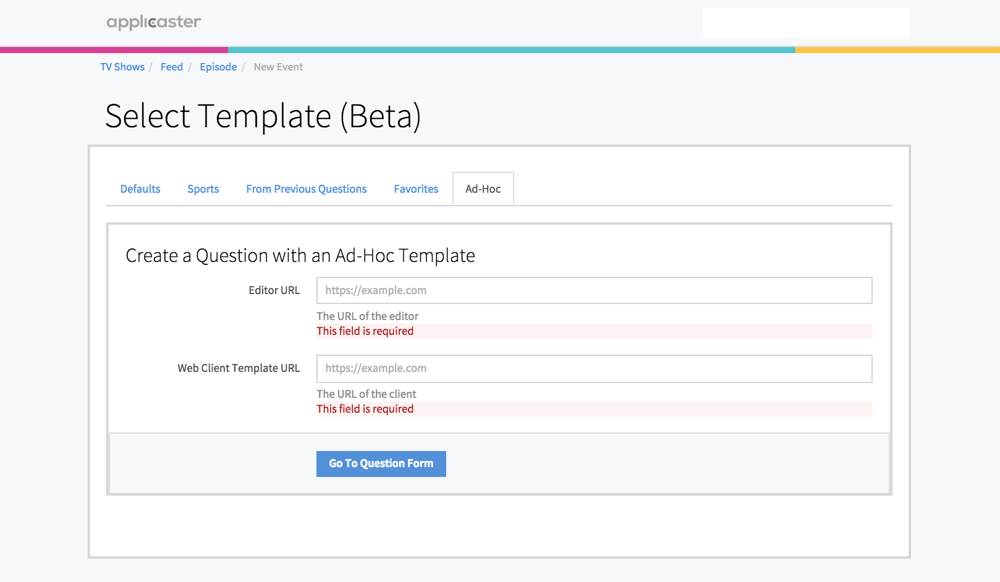
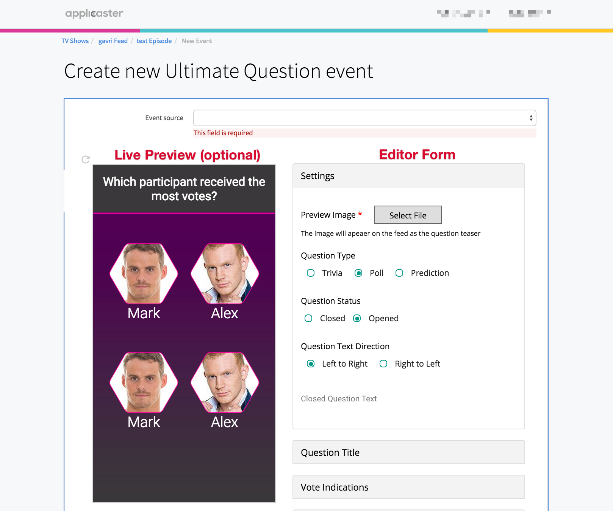

# Questions Editor & Client SDKs

## Overview
Applicaster Questions SDKs provides a way to build your own HTML5 question templates while taking benefits of Applicaster infrastructure for saving question data and end user answers on high scale.


The  SDKs are a bundle of two SDKs; the *Question Editor* and the *Question Client*. As a developer you’ll need to develop  both of them for your implementation.

* Using the *Question Editor SDK*  you can build an editor template that the CMS operator can use to create new questions according to your needs.
* Using the *Question Client SDK*  you can create templates that use the configuration the CMS operator set on the editor you created and present it to the end user.

## Environment Setup

#### Step 1 - Get an Ad-Hoc Sandbox link
To use the *Question Editor SDK* you must have a valid Applicaster username. The development of a Question Editor template is done using a Ad-Hoc sandbox tool that Applicaster provides on Applicaster Starlight CMS. Please contact your Applicaster representative to provide you with that link.

#### Step 2 - Open the provided link and fill the editor and client URL.

Open the provided Ad-Hoc Sandbox link and click on the Ad-Hoc template tab.
Here you will need to fill out the URLs of both the editor URL and the client template URL.  These URLs are the place where you host the templates you develop. During development its advised that you serve your developed templates form your own localhost.



#### Step 3 - Implement the SDKs in the links that you provided

Implement the two SDKs and host them in the links you provided on step 2.
The implementation and API reference is document below at the *usage*  section of each SDK. 

> Note: See the **Deploying To Production** section to see how to host your templates for production use.


### Questions Editor js SDK (BETA)

Applicaster Questions Editor SDK provides a way to build your own question editor template and to hook it into the Applicaster’s Question service. Using the SDK the editor can access and save questions without the need of any backend capabilities.

After providing the URLs (Step 2) The Editor is presented as an iFrame inside Applicaster Starlight CMS. The editor implementation can range from a simple UI
on an HTML form to a mini-app that presents Live previews while configuring the question customisation settings.

**An example of a question editor implementation**



### Usage

To use the SDK you need to include the following in your editor HTML:

```html
<script src=“https://cms.applicaster.com/assets/sdks/questions_sdk.v0.1.js”></script>
```

### API Reference

The SDK object is available on the global window at `window.Applicaster.QuestionsSDK`.

### Functions

#### QuestionsSDK.get()
Get the question JSON object

```javascript 
Applicaster.QuestionsSDK.get()
.then(function(question) {
  //populate the template editor with the question data
  console.log(question)
})
.catch(function(error) {
  // catch errors
  console.log(error)
});
```

#### QuestionsSDK.uploadFile()
Upload an image file using Applicaster Starlight CMS file uploader dialog
and get back the URL to the uploaded file 

```javascript 
Applicaster.QuestionsSDK.uploadFile()
.then(function(imageUrl) {
  //populate the template editor with the imageUrl
  console.log(imageUrl)
})
.catch(function(error) {
  // catch errors
  console.log(error)
});
```

### Callbacks
When initialising your questions editor, provide the callback as specified below.

#### Applicaster.onCMSGet(callback)
The callback will be called by the CMS anytime it
needs the edited question data (e.g. on question save)
The callback should return the question object or undefined
if the question object isn’t ready yet.

```javascript 
Applicaster.QuestionsSDK.onCMSGet(
  function() {
    // e.g. called when when the CMS user clicks
    // question save button
   return questionObject 
  }
)
```

### Events

#### Applicaster.onCMSSet(eventCallback)
The event will be called by the CMS anytime the question
data has been changed externally by the CMS.
e.g. returns errors when trying to save a malformed
question object.

```javascript 
Applicaster.QuestionsSDK.onCMSSet(
  function(question) {
    console.log(question)
  }
)
```

### Basic HTML editor structure

```html
<html>
  <head>
    <script src=“https://cms.applicaster.com/assets/sdks/questions_sdk.v0.1.js”></script>
    <script>
      var questionObject;
      // Register onCMSGet callback
      Applicaster.QuestionsSDK.onCMSGet(function() {
        // e.g. called when when the CMS user clicks
        // question save button
        return questionObject 
      })
      
      // Register onCMSSET event
      
      Applicaster.QuestionsSDK.onCMSSet(
        function(question) {
        console.log(question)
      }
)
      
      // Get Question data if available (when editing an exsisting question)
      Applicaster.QuestionsSDK.get()
      .then(function(question) {
        // populate the template editor with the question data 
        // and manipulate the question (add answers, question text etc.).
        //
        // Make sure you update questionObject when you change its data
        // so when the CMS user saves the question he gets the most up to
        // date question data.
        questionObject = question;
      })
      .catch(function(error) {
        // catch errors
        console.log(error)
      });
    </script>
  </head>
</html>
```

### Question JSON structure
***

best shown by an example:

```javascript
{
  //fields you get but can’t change. there may be others.
  //don’t touch them. return as they were received.
  id: “112523ACCDFF124125”,

  //fields the editor is responsible for, and should let the user edit them.
  text: “Who will be the queen of prom?”,
  answers: [
    {text: “Julia”, correct: false},
    {text: “John”, correct: false},
    {text: “Jin”, errors: [{correct: “must be either true or false”}]}
  ]
}
```

> **Note:** any question object may have an `errors` attribute. if it has one, it contains a list of errors, each is an object specifying an attribute the error relates to, and what the error is. it is your responsibility to provide a UX that accounts for errors, and displays them.

Most common use case is: CMS calls your `onCMSGet` callback, you return some data, the data is sent to a service that returns the data with some validation errors on it, then the CMS calls your ‘onCMSSet’ callback with this data like so: `mySetCallback(questionJson)`. 

# Questions Client js SDK

Applicaster Questions Client SDK provides a way to build static HTML questions
and integrate them with the Applicaster Question service infrastructure.

With this SDK a developer can:

* Get question data and statistics on user responses.
* Answer a question.


## Usage

### Prerequisites

* Have a valid participant question URL.
For getting this URL you will need to create a question using the Question Editor
SDK. Please contact your Applicaster representative if you have any questions.


To use the SDK you need to include the following in your HTML question template
head:

```html
<script src=“http://assets-production.applicaster.com/questions/sdk/v1.js”></script>
```


After the page is loaded you will receive a `window.Applicaster.question` object.
See below for directions on using this SDK.


## API Reference

### Functions

#### Applicaster.question.getQuestion()

Get the question object.

```javascript
Applicaster.question.getQuestion()
.then(function(question) {
  // the question was successfully loaded.
  // You also get a question object param with all the question data.
  // Here is an example of a question object:
  //
  //{
  //  account_id: “211cf8c9e69702d0818010080”,
  //  text: “Did Marie Curie won the Nobel prize?”
  //  state: “closed”, // can be “closed”, “published” or “locked”
  //  max_answers_per_participant: 1, // can be null for unlimited
  //  answers: [
  //    {
  //      id: 1,
  //      text: “Yes”,
  //      correct: true,
  //      extensions: {}
  //    },
  //    {
  //      id: 2,
  //      text: “No”,
  //      correct: false,
  //      extensions: {}
  //    }
  //  ],
  //  extensions: {
  //    image: “http://upload.wikimedia.org/wikipedia/commons/7/7e/Marie_Curie_c1920.jpg”
  //  } // extensions are any extra metadata the question editor provided for the
  //    // question or for the appearance of the template.
  //}
})
.catch(function(error) {
  // catch errors
  console.log(error);
})
```
> Note: you can pass a question URL as a parameter to the `getQuestion(url)`
function if for some reason you don’t want to load the question form the
question-url query string.

#### Applicaster.question.answer()

Send participant question answer.
The answer to send is identified by its id. you should pass an array of the
participant selected answers.

```javascript
Applicaster.question.answer({ “ids[]”: [1] })
.then(function(response) {
  //called after success 
.catch(function(error) {
  catch server and validation errors
  console.log(error);
});
```

#### Applicaster.question.getAnswersPercentage()

Get percentage per answer.

```javascript
Applicaster.question.getAnswersPercentage()
.then(function(stats) {
  //returns a stats array with percentage per answer
  // for example:
  //[
  //  {
  //    id: 1,
  //    correct: true,
  //    percentage: 44.05
  //  },
  //  {
  //    id: 2,
  //    correct: false,
  //    percentage: 63.95
  //  },
  //]
})
.catch(function(error) {
  catch errors
  console.log(error);
});
```
#### Applicaster.question.getParticipantInfo()

Get participant information about the specific question.
Returns `answers_left` integer to see if the user can answer multiple times on a
given question. Returns `is_last_answer_correct` boolean to check if the last
answer the participant send was correct or not - this can be used for checking
if a resolved prediction question is correct.

>Note: The participantInfo is retrieved from the local catch of the device.
In case you want to get the latest sate of the question resolve `getQuestion()`
before calling the function.

```javascript
Applicaster.question.getParticipantInfo()
//returns (example)
// {
//  answers_left = 0.
//  is_last_answer_correct = true
// }
//
```

## Deploying To Production.

You can upload your created templates on your own to a CDN or contact Applicaster representative to pass him your created templates on a zip file.
If you choose the second option Applicaster will host the templates on an
Amazon S3 instance and serve your templates on a high scale CDN.