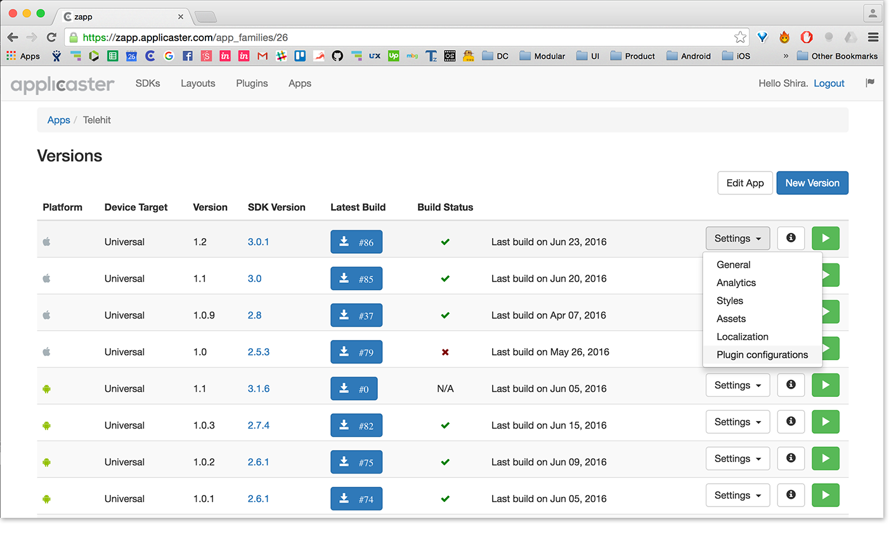
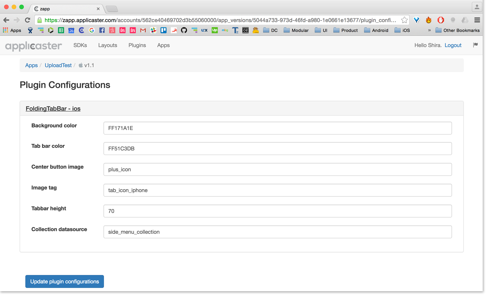
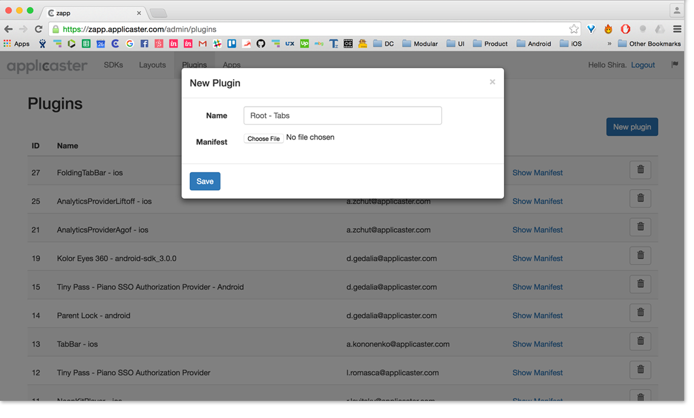
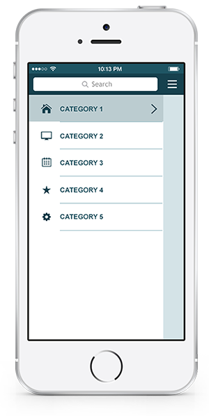
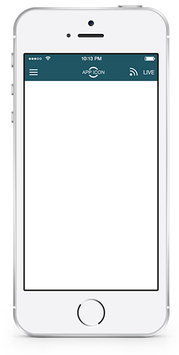
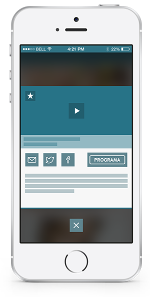
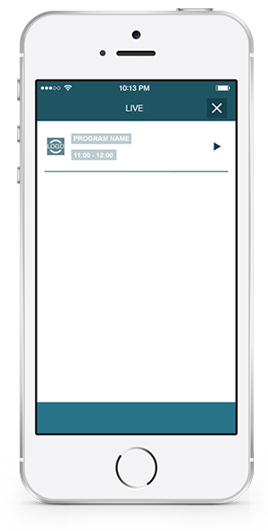
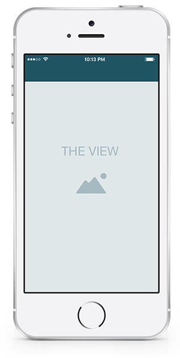

# Root Plugin API

| Version | Description |
| - | - |
| 1.0.0 | First Release |

## About
Created by Applicaster, The Root Plugin enables integrating of new navigation menus to all Zapp Apps. Applicaster’s goal is to allow diversity and uniqueness to the templates offered on both Android and iOS.

## Getting Started

The Root Plugin allows integrating existing Root Plugins, as well as new ones to be developed and designed. You can implement a Root Plugin both in existing apps as well as in new ones. Currently most Applicaster layouts use a default root, which is not a plugin.

#### Use Existing

1. Under The ‘General’ section in Zapp menu of your App, choose the plugin you would like to add to your app from the dropdown field.
2. In order to configure the plugin chosen, choose ‘Plugin Configuration’
3. and customize the parameters given of the specific Plugin. In the future plugins will be placed under 'features', each one under its relevant section.

#### Creating a New

1. Under Plugins, click the ‘Create a new plugin’ button.
2. Give the Plugin a title. Please give both platforms the same name.
3. And upload the plugin manifest following [these instructions](https://github.com/applicaster/zappifest).

## Areas
There are 3 areas the Root Plugin defines, from a UI aspect: **The Navigation Pane**, **The Navbar** and **Transitions**.

#### Navigation pane

The navigation pane lists the categories (the screens) that the App has, as well as indicates the category in which the user is currently viewing. The plugin defines the location of the navigation pane, on the left, right, top, bottom of the screen, or as  floating buttons. The current existing root defines the navigation pane to be opened on the left hand of the screen.

#### Navbar / Title Bar
The Navbar / Title bar is used for navigational purpose. 
A new plugin can either use the default ‘modular’ navigation bar, or a new developed one.
In the future we intend to have a few parameters to customize each navigation bar developed per plugin. For example: full colored navbar, or an overlay one.

The Zapp App has 3 types of screens with 3 types of navbars:
**The Top Screens**, **The Internal Screens** and **The 'Specific Screens'**. Each one has some differentiation in the UI on the navbar. Each plugin could define the UI elements differently. However, the structure of the screens is common to all Zapp Apps.

Below is the logic of the 'modular' standard navbar:
**Top Screens**: 

iOS: all the categories that are linked from the navigation pane will receive the UI of the 'Top Screens', as they open a new stack each. 
On Android: the only 'Top Screen' that receives this UI is the Home Screen. 

The UI elements of the Top screens navbar are: navigation button opening the navigation pane, screen name / logo, links with icons to the following: Feed, CM, Search, Live,  Special Category, 3rd party link. Number of links are defined in the style of the navbar. (currently in the JSON, in the future it should be in Zapp).

**Internal Screens**: 

iOS: All screens that are linked, hence pushed from the Top Screen (first screen on the stack).
Android:  

The UI elements of the Internal screens navbar are: ‘Back’ button, Screen name, a few of the following links: Feed, CM, search and Live. On iOS the Special Category and the 3rd party link van also be displayed in internal screens.

**Specific Screens**: UI elements in these screens are defined by the screens themselves and not by the navbar / title bar.
iOS: Intermediate, Player, Video Loading, Validation Flow, Offline Screen.
 

These UI elements will appear throughout all screens of the same type.

- There is currently an infrastructure to enable contextual menu to screens of a specific nature. Such as: ‘Web View’, Favorites. (still needs development).
- Currently it is not possible to have contextual menu on the navbar/title bar for specific screens that are not identified by nature.
- The navigation bar is applied only on the top bar. However, Each new root can define its own navigation system and location, see option menu types under “Root Types”.

#### Transitions
- The Root Plugin has the ability to define the transition between each screen / fragment it navigates to. i.e.: **Push/Add** (Android: Top and Inner screens, iOS: Top and Inner Screens), **Present** (Android: Live, Webview, iOS: HQME, Live Drawer, Feed, CM, Player, Video Loading, Intermediate), **Swipe / Other** transition.
- Transitions inside the navbar and navigation pane are developed by the plugin itself.

#### View
The View is the rest of the screen where the content and the banner are displayed. The root does not affect any information there, meaning; inner navigation such as tabs won’t be reflected in the Root areas.

## Types of Root
See a few types of navigation root menus that could be developed as a plugin for our Zapp Apps. One existing Root plugin is the Side Menu, which can be set very easily.

[Examples](http://)

## 	Developer Links
[Android](https://github.com/applicaster/ZappRoot-Android/wiki/1.-introduction)
[iOS](https://github.com/applicaster/ZappRoot-iOS)
