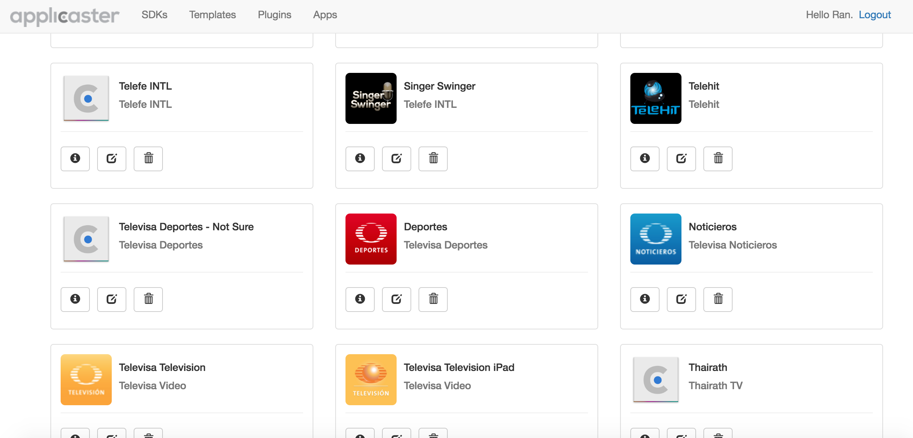

# DRAFT Zapp Configuration Manual

## Introduction
This manual was created to guid Applicaster employees on how to create and set up a new app for a new account.

The idea is to have an app ready from a chosen Zapp template with all common Applicaster features enabled and with sample of content.

After you complete the task you’ll have an app with the following features:

* Structured dummy content.
* dummy EPG according to the template options.
* The option to fire Sync button events.

### The following should be configured separately - please ask support help if needed.

* Setting up - push notifications.
* Setting up app Feed, CrossMates, GroupChat in Stars or Starlight.
* Uploading videos manually or setting up ingestion
* Setting up Atom feeds for news articles.

[The road is long…](https://www.youtube.com/watch?v=Si7gu9yGz64) but its going to get shorter.

## Prerequisites
Before you begin, open a new browser window and open the following links (each one on its own separate tab) **Make sure you can login to all those links**:

* [accounts.applicaster.com - Accounts](https://accounts.applicaster.com)
* [ais.applicaster.com - AIS](https://ais.applicaster.com)
* [admin.applicaster.com - Applicaster2](http://admin.applicaster.com)
* [zapp.applicaster.com](https://zapp.applicaster.com)

> Note: Each time you’ll need to move between tabs - a note with the name of the tab will be shown.

## Create new account
On `(Accounts tab)` - Create new account in accounts.applicaster.com
Click on Accounts → New

## Enable all relevant account features (Applicaster2 Tab)

* Click on the management tab - it will open up in the Accounts section. Click on the account link you just created.
Click on the account link.

> Note: It might take a few minutes to have the account link available.

Check all relevant features in the feature management section:

> Note: Make sure you are not checking the “Allow New Content System” as will disable the option to use content ingestion.

## Copy Account id (Applicaster2 Tab)
Copy the Applicaster Account id you just created.

## Paste Account Id (accounts Tab)
Paste it under “Applicaster2” back in accounts.applicaster.com (click on the edit tab of the account you just created).

and click update account.
You should see the following:

## Enable your username to view and manage the account you created. (Applicaster2 Tab)
Go to management/users and click on your username. Then check the account you just created.

## Creating the main content category (Applicaster2 Tab)
Go to VOD section (make sure you selected the account you just created)

Create the first content category (make it of type generic) - it’s name should be “Content”

Go back to the broadcaster in Management section - and choose the content category you just created as the content category.

## Fix Broadcaster ID (Applicaster2 Tab)

* Copy the broadcaster Id
* Go to VOD -> Settings
* For each CDN URL paste that account Id after the `broadcasters/`  path

## Add mandatory UI_Tags (Applicaster2 Tab)
Go to your account VOD section. go to the Collections tab and create new 6 collections with the following UI_Tags:

1. Home UI_tag: home_collection
2. Nav bar UI_tag: navbar_collection
3. Side Menu UI_tag: side_menu_collection
4. Side Menu Two Level ???: sidemenu_two_level
5. Home Tablet ???: home_collection_tablet
6. Settings ???: settings_collection
7. Channels: channels_collection
!!! we should move channels_collection from the template to the the SDK.

??? what is “shows_activities” ui_tag?
??? what is “category ui_tag” ui_tag?

You should get the following once you are done:

## Create a new app (Applicaster2 Tab)
Go to management -> apps -> new

** If you are creating both iOS and Android apps you should do the following process twice - one for each platform.

* Give your new app a name.
* choose Identifier - this will be used as the unique identified in the app store or the Google play store. the name should be as follows com.<app_name>  where <app_name> should be replaced with the desired app name - use small letters and numbers only.

* Choose the desired store (only iOS or Android are currently supported).
* Pick the account you just created.
* Give the app a url scheme - you can use the same <app_name> you gave above - but do make sure that you put the same scheme for both the Android and iOS apps you create.

## Create a new app (AIS Tab)
GO to the account that you created and add the following:
* Go to apps and click on the new app button.
* Fill all the relevant info - if you are creating both iOS and Android apps you should do this process for each platform
* Submit the form.

> Note: make sure you give the app the same name and the same bundle identifier you gave on Applicaster2

## Create new app phase 1 (Zapp Tab)
click on the ’New App’ button
choose the account you created and give your app a name - **name should not contain spaces or special characters**.

Live the Form open as you’ll need to gather some data from the other CMS’s and paste it in the form

## Copy AIS bucket. (AIS Tab)
Go to the AIS tab and choose the account you created copy the bucket id of the app.

## Create new app phase 2 (Zapp Tab)

Paste the bucket id in the app form you just created

## Copy Broadcaster ID (Applicaster2 Tab)
Go to /management/broadcasters and copy the broadcaster Id that has the same name of your account

## Create new app phase 3 (Zapp Tab)

Paste the broadcaster Id you copied earlier.

## Copy the API Private Key (Applicaster2 Tab)

Go to management -> accounts
and copy the API private Key of the account you created.

## Create new app phase 4 (Zapp Tab)
Paste the Api private key in the opened Zapp form

## Create new app phase 5 (Zapp Tab)
Choose your preferred language (you’ll be able to change it later on)

## Create a new App version
you’ll need to do this process per platform if plan to release both Android and iOS versions.

Click on your newly create Zapp app.

Click on the button to create new version.

* select the store type (Apple Store - iOS or Android - Google Play)
* Device target - use Universal if there is a single app for both tablet and smartphone.
* App name should be pre-configured - leave as is.
* Bundle Identifier should be pre-configured - leave as is.
* Version give the wanted app version - for new apps start with version 1.0
* SDK version should be pre-configured - leave as is.
* Choose a template according to your needs. If you don’t know what template to choose please consult the Zapp PO.
* Import Settings From - for new apps use ‘SKD’

### Fill out optional fields  
* In the URL scheme put the same URL scheme you put when you created the app on Applicaster2 (earlier in the manual).
* Facebook App Id - Please contact support if you don’t know how to set a Facebook App id.
* Twitter API Key - Please contact support if you don’t know how to set Twitter.
* Twitter API Secret - Please contact support if you don’t know how to set Twitter.

# Specific configurations Per template.

## Fuzion Template

### Setting up dummy content.
