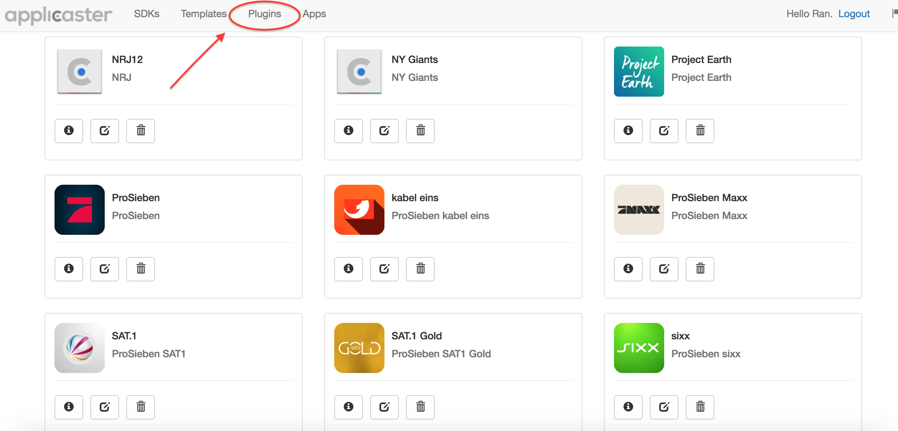

# Zapp Release Notes
## 1.13.0 Plugins - (May 5, 2016)

## New Features
* We added the Plugins section.

Now we can add add-ons to the modular app. The plugins section will be a marketplace of add-ons. When creating a version you will be able to choose which plugins you want to add. Enjoy the new era!

* Zapp is now filtering only relvant layout styles when customizing an app. You will no longer see the irrelevant keys for a specific layout (there are still many keys to customize...)
* We added some api features related to versioning of the localization, styles and assets to help the modular decide if it needs to reload this files or to use cached ones. This should make our app load a little bit faster.
* Added an assets json file that can be in use to remptely load assets (upon client side decision)

## Bug Fixes
* Some ui fixing related to image lazy loading.
* Changes assets tags ui.
* Sending `google_api_project_number` to android build.

## 1.12.0 Apple TV Subscription - (March 29, 2016)

## New Features
* We added the `Settings` section to Apple TV configuration screen. You can now set subscription for the app. Also allowing other sections in the Settings Menu.
* Some UI changes to the home screen App Dashboard. Once you will upload an n iOS app launcher asset, it will appear in as the app icon.
* Added private API end points - App Families and App Versions.
* Add Mixpanel Engagement configuration to app analytics.
* Lazy loading images on SDK assets and Version assets.

## Bug Fixes
* Bug Fix - Fixed the issue that did not allow to delete images that are not obligatory for the Apple TV app.
* Bug Fix - There was a strange issue that was not copying the release versions files when creating a new version from existing, now it is solved.

## 1.11.0 Build Process Indicator - (March 15, 2016)

## New Features
* Better indicator for the build process. Once pressed on build version button, you will now have a more detailed indication which phase of the process the build is currently executing. It will allow you to go to a specific build on CircleCi to have more details.
* Adding Attributes missing notice - When pressing on the build version button, you now have a notice that indicates if you are missing some attributes for the version, that might affect parts of the versions functionality. 
* Allowing uploading multiple non-image assets for the same key for different screen sizes.
* Adding `Media Type` option for asset to choose between Image and Non-Image asset type.
* Adding versioning functionality - allowing the client to differentiate changes in Zapp remote configurations (localizations, styles, assets). This API allows the client to check if there were changes in the configurations of a version.
* Analytics - Added `People` option to Mixpanel provider.

## Bug Fixes
* Bug Fix - Fix bug that failed Android build sending `drawable-universal` folder.
* Bug Fix - Validation failed notice when creating version based on another version.
* Some other backend and minor ui fixes.

## 1.10.0 Apple TV - (Feb 23, 2016)

## New Features
* You can configure and build APPLE TV versions. Create new tvOS SDK and customize your app.  
* Remote configurations - when creating an app it creates a remote configuration file consists of styling, assets, localization and general configuration.

## Bug Fixes
* Bug Fix - Fix bug that did not recognize non image asset if default was not uploaded.
* Some other backend bug fixes.

## 1.9.0 Various New Features - (Feb 14, 2016)

## New Features
* Now you can upload custom fonts to App when creating or editing it. No need for any PR or any additional work.
* There is no need to create the apps on Applicaster2 anymore. Apps are created when creating new app on Zapp, or creating a new version (and the app does not exist on Applicaster2 server).

## Bug Fixes
* Bug Fix - Fix bug the ask to upload release certificates every time trying to build a new release version.
* Some other backend bug fixes.

## 1.8.0 Various New Features - (Jan 30, 2016)

## New Features
* When building a version, we added an indication that shows if the build is in process, and we prevent users of building another version while a build is currently in process.
* Finally (!) there is no need to copy fields from other systems when creating a new version/new App. Bucket, Broadcaster, Api private key are pulled automatically. The configuration process is a little bit easier.
* Less configuration is needed - Now, when creating a new app it automatically creates the relevant apps in the AIS. All push certificates/keys are configured via Zapp.
* Adding Zapp Audit. On the top left corner, there is a small flag. Clicking on it will lead you to a section that will show you each action that was done in the system. Now every step that was done has a name behind it.
* Adding the templates section. Through this section you can view, add and update exisiting templates status. Just make sure that the template was added to the code.
* You can now mark if a version is using a Video splash or a static image splash and upload the relevant file.
* Auto retry on build timeouts (Backend)
* Crash log ID can be set when creating or updating an app.
* For developers - added the option to view the params that are sent to CircleCi build and use it locally for development and testing.
* Adding breadcrumbs to all app version screens.
* Bug Fix - Fixing the strange behaviour that was changing the color to the word transparent when setting transparent RGBA or HEX value.
* Bug Fix - Fixing issue that allowed saving an empty color.

## 1.7.0 Bulk Upload - (Jan 6, 2016)

* You can now upload all assets in a bulk using zip file.
> Note: folder structure, file names and sizes are crucial for a successful upload.
* Apps home new UI. + Option for searching the apps.

## 1.6.0 L1 - (Dec 23, 2015)

## New Features

* Bug Fix - keys are updated when upgrading an SDK.
* Bug Fix - Debug dialog is enabled on Android on debug versions.
* Monitoring of app build status on Slack - channel #platform_notifictions

## 1.5.0 L1 - (Dec 22, 2015)

## New Features

* L1 layout ready for use for both iOS & Android.
* Full keys support for assets, styles, analytics, localization.
* Support for left to right and right to left from the Zapp UI.
* UI improvements - add breadcrumbs in Zapp.

## Known Issues

* Keys are being reset when upgrading the SDK.
* No debug dialog on debug version on Android.
* No notifications when build failed.

***

## 1.4.0 Zapp-Roles - (Sep 20, 2015)

### New Features

* You can access Zapp production form [zapp.applicaster.com](https://zapp.applicaster.com)
* Zapp now has 3 types of roles of authorization (managed from applicaster accounts)
	* **SDK Developer** - Can create edit & deleted SDK versions
	* **App Admin** - Can create edit & delete apps. Can create edit & delete app versions. Can configure assets and localization strings.
	* **User** - Can configure assets and localization strings of existing app versions.

## 1.3.0 Open-Customer-Permissions - (Sep 7, 2015)

### New Features

* Customers can now configure their apps’ texts remotely without going through the
project manager.
* Customers can now set their apps’ assets.

> **Note:** To see the assets changes in action. A new build is required.

* Zapp now alerts the user if there are any configurations missing for a
successful build.

## 1.2.0 Android-Automation - (Aug 27, 2015)

### New Features

Allow to build an Android app for a specific account with a given single template.

> Follow [Account setup manual](https://docs.google.com/document/d/1MzUKNgwbYy8HtVl0apN6Wqk6POr7CkBtb-sKM0eYqyk/edit) To configure manual settings that currently are not included on the auto-build process.

***

## 1.1.0 Assets-Control (Aug 4, 2015)

### New Features

Allow to configure all app image assets.
developers can download the created asset library and embed it in their code.

> Any update of the assets will require a new build.

***

## 1.0.0 Remote-Localisation (Jul 8, 2015)

### New Features

Allow to configure remotely all texts of the app including their translations.

***
