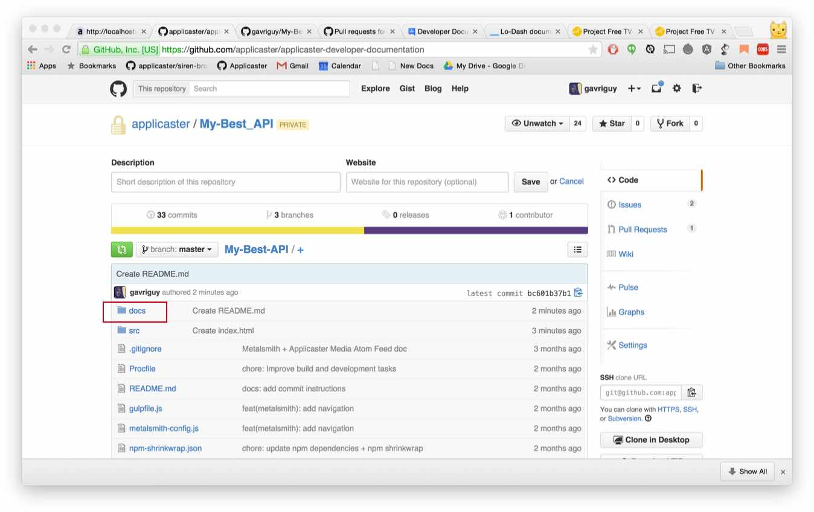
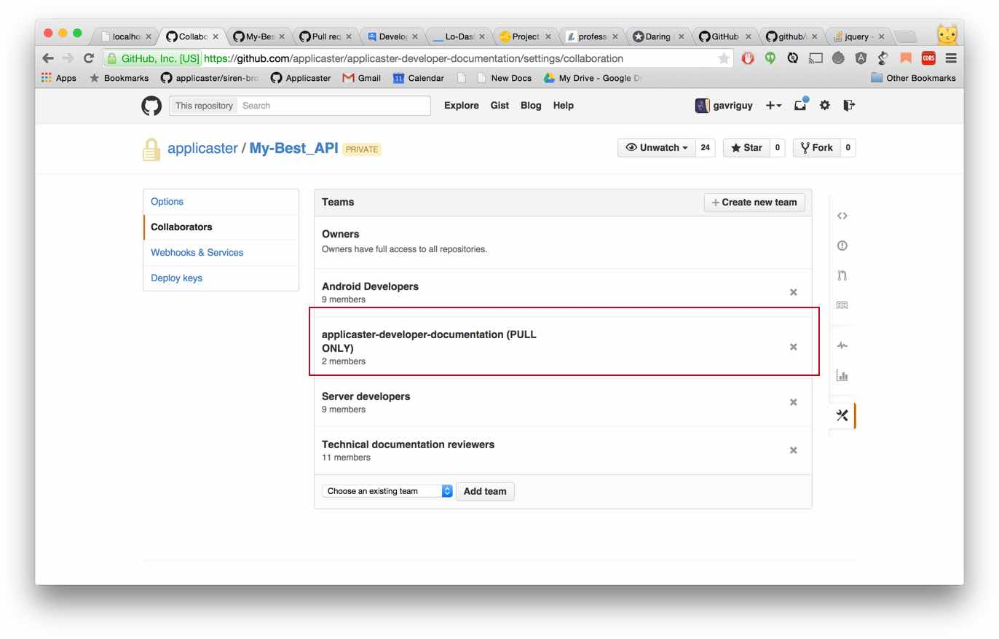

# Overview
Applicaster Developer Documentation is a static site builder that holds all the relevant technical and development documentation in a single place.
The project imports the documentation data from Applicaster Github repositories (public & private) using a manifest file located at `config/api.manifest.json`.

## Motivation
When building the tool the following considerations were taken into account:

* Have [a single source of truth](http://www.wikiwand.com/en/Specification_by_example#/Examples_as_a_single_source_of_truth) By providing an website for accessing all the documentation documents we have.
* "Living Documentation" - Keep the documentation as a close to the code as possible - making them maintainable by the developers themselves and ease the process of keeping them up-to-date.
* Maintain as much as possible the current workflow of our repos documentation. Docs can be taken form the code itself or from Github wiki.

## Accessing the documentation
Because Applicaster documentation holds propriety & technical information, Only logged in users with a valid Applicaster single sign on [account](accounts.applicaster.com) can access the documentation.

The documentation documents are divided into two groups: **`releases`** and **`internal`**; As the names imply - the **`releases`** section is available of authenticated users, while the **`internal`** section can be access only 

# Guides
## How to add a new documentation package

### Setting up your repo
For the guide lets assume you created a new private Github repo in [the Applicaster Organisation](https://github.com/applicaster) called **My-Best-API** and created a README.md file inside the docs folder

> **Note:** The documentation tool only accept documents that were written in [Markdown](http://daringfireball.net/projects/markdown/) and their relative linked and images assets.



Because **My-Best-API** is a private repo we will need to add the **`applicaster-developer-documentation (PULL ONLY)`** team to the repo in the repo settings page.
This will allow the documentation tool to import the docs on its build process.
**Failing to add the team to the repo will cause the build to fail.**



Now that everything is set up, you can add your **My-Best-API** docs package into the Applicaster Developer Documentation manifest.

### Adding the documentation package to Applicaster Developer Documentation
* Fork [github.com/applicaster/slatedocs.git](https://github.com/applicaster/slatedocs.git) repository
*  Open the `config/api.manifest.json` file and add your package manifest.
The package manifest is a JSON object with the following properties:

```javascript
	{
	    "title": "My Best API",
	    "kit": "PALTFORM-KIT",
	    "relativeURL": "my-best-api",
	    "package": "https://token@github.com/applicaster/my-best-api.git",
	    "glob": "./docs/",
	    "splitView" : true,
	    "internal": true
	 }
```
#### Properties Description

| Name | Description | Default Value | Mandatory |
| -- |-- | -- | -- |
| `"title"` | Will be the title of the docs package in the documentation tool | - | Yes |
| `"kit"` | The Applicaster Kit the documentation belongs to. Can be one of the following: "PLATFORM-KIT", "CONTENT-KIT", "APP-STUDIO", "GAME-KIT", "INFRASTRUCTURE" |  "PLATFORM-KIT" | No |
| `"relativeURL"` | The Relative URL that the documents will be located | - | Yes |
| `"package"` | The Place that the documentation files are located. In most cases this will be an https ling to the Github repo. In case this is a private repo you the token@ prefix as mentioned in the example above. The package conforms to the [Bower](http://bower.io/docs/api/#install) package definition.| - | Yes |
| `"glob"` | The package root relative path the docs are located in | - | Yes |
| `"splitView"`| If to use a split view representation template in the docs. Good for documentation with short text example snippets | `false` | No |
| `"internal"` | If set to true the docs will be available only to Applicaster employees. If not set or set to false the docs will available to all the users who have access to the documentation platform - this includes Applicaster customers and 3rd party developers | `false` | No |

## Recommendation for well built and well styled documentation package
Applicaster Developer Documentation is capable to show any document that is a valid Markdown document. Nevertheless, There are a few recommendations that will make sure The documentation will look good inside the tool.

* Always start your documentation with H1 heading (`#`).
* Use H1 headings (`#`) to Start a new documentation section.
* Use H2 headings (`##`) for sub-sections.
* If possible Put all your documentation in a single file - In most cases well written documentation should feet into a single page.
* use blockquote (`>`) to highlight important section in your doc - this can be used for a notation, warning etc.

